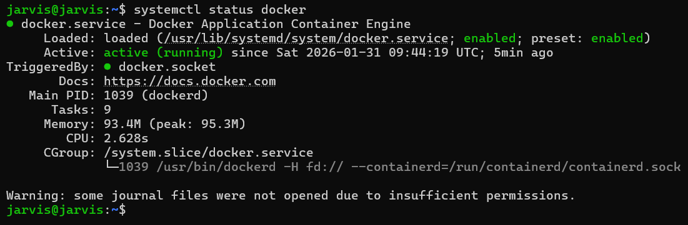
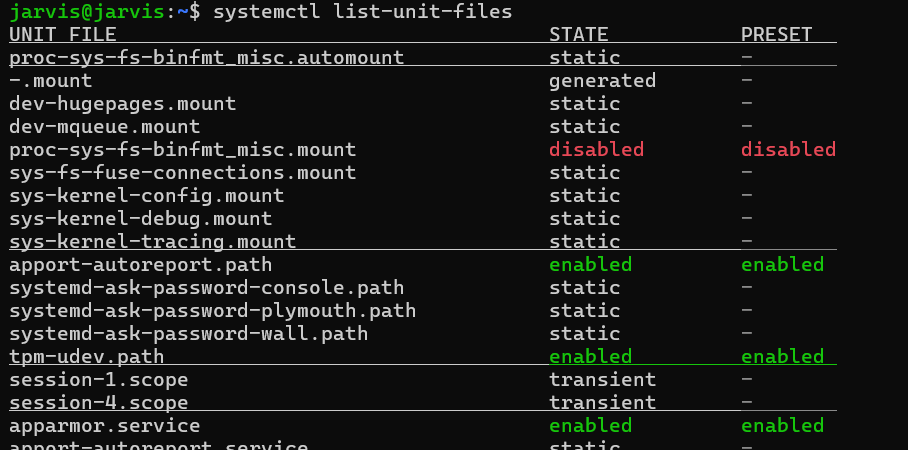
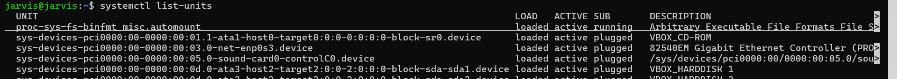
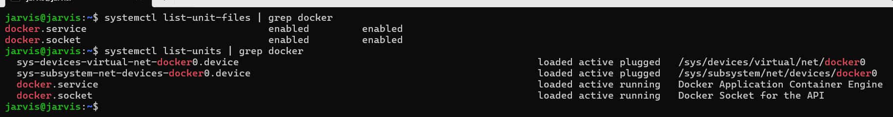
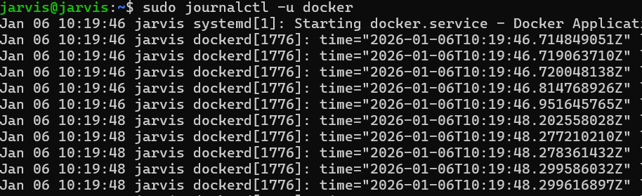
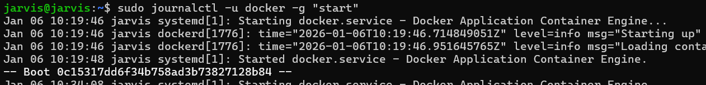
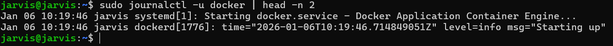
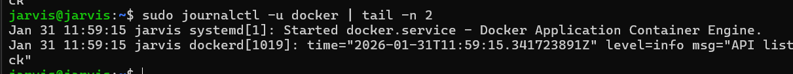
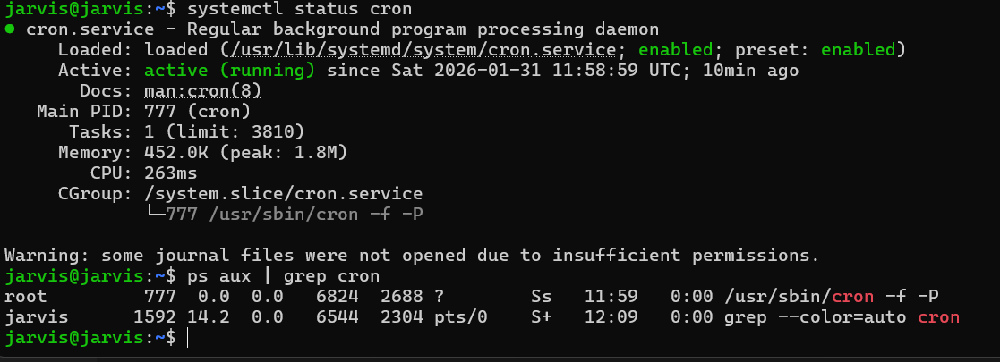
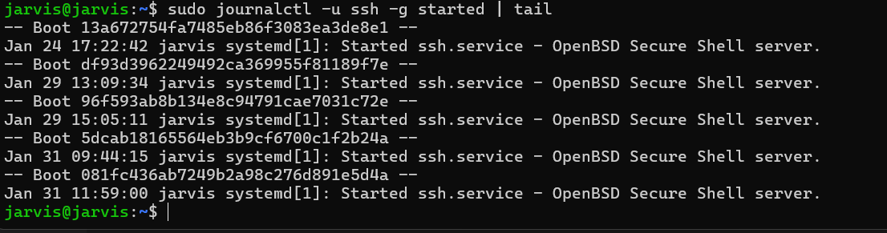

# Day 04 – Linux Practice: Processes and Services

## Task
---

## Guidelines
Follow these rules while creating your practice note:

- Run and record output for **at least 6 commands**
- Include **2 process commands** (`ps`, `top`, `pgrep`, etc.)
- Include **2 service commands** (`systemctl status`, `systemctl list-units`, etc.)
  - systemctl status docker
  
  - systemctl list-unit-files
  
  - systemctl list-units
  
  - systemctl list-units and systemctl list-unit-files | grep docker
  

- Include **2 log commands** (`journalctl -u <service>`, `tail -n 50`, etc.)
  - journalctl -u docker
  
  - journalctl -u docker -g "error"
  
  - precisically top 10 or -n 2 result using head -n
  
  - bottom 10 or -n 2 result using tail -n 2
  
- Pick **one service on your system** (example: `ssh`, `cron`, `docker`) and inspect it
  - cron
  
  - ssh
  ` sudo journalctl -u ssh -g started | tail`
  
  - `sudo journalctl -u docker -g started | tail -n 2`
  
- Keep it **simple and actionable**

Suggested structure for `linux-practice.md`:
- Process checks
- Service checks
- Log checks
- Mini troubleshooting steps