# Day 05 – Linux Troubleshooting Drill: CPU, Memory, and Logs

## Task

## Guidelines
Follow these rules while creating your runbook:

- Run and record output for **at least 8 commands** (save snippets in your runbook)  
  - **Environment basics (2):** `uname -a`, `lsb_release -a` (or `cat /etc/os-release`)  
    - uname -a
    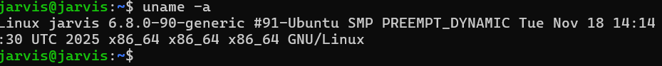
    - cat /etc/os-release
    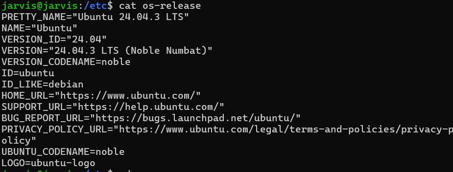
  - **Filesystem sanity (2):** create a throwaway folder and file, e.g., `mkdir /tmp/runbook-demo`, `cp /etc/hosts /tmp/runbook-demo/hosts-copy && ls -l /tmp/runbook-demo`  
    - 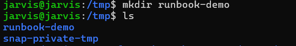
    - 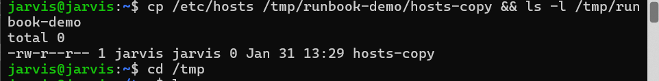

  - **CPU / Memory (2):** `top`/`htop`/`ps -o pid,pcpu,pmem,comm -p <pid>`, `free -h`, `vm_stat` (mac)  
    - top
    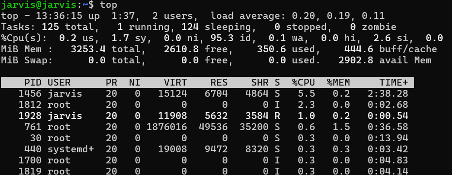
    - htop
    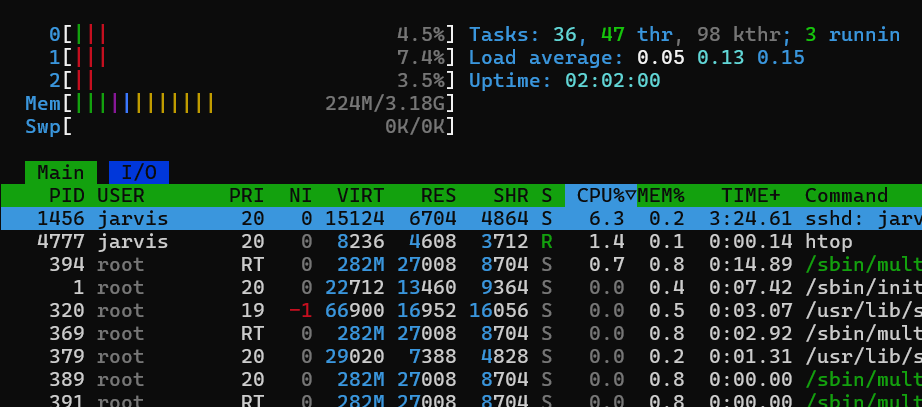
    - ps -o pid,pcpu,pmem,comm -p PID
    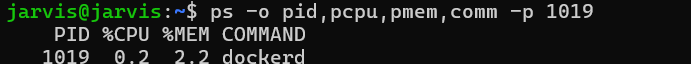
    - free-h
    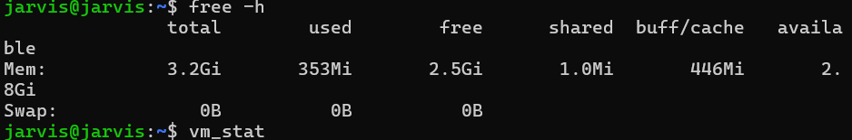
    - vmstat
    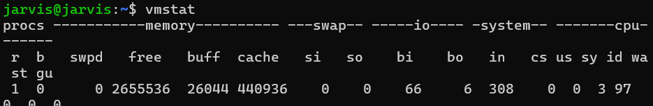
  - **Disk / IO (2):** `df -h`, `du -sh /var/log`, `iostat`/`vmstat`/`dstat`  
    - df -h
    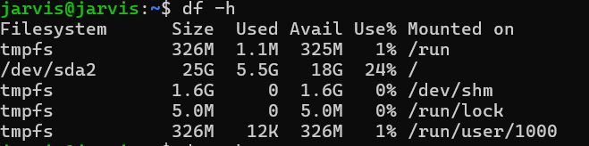
    - du -sh /var/log
    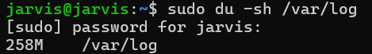
    - iostat
    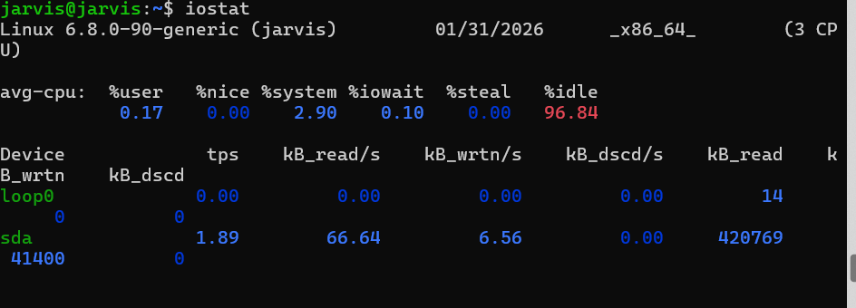
    - vmstat
    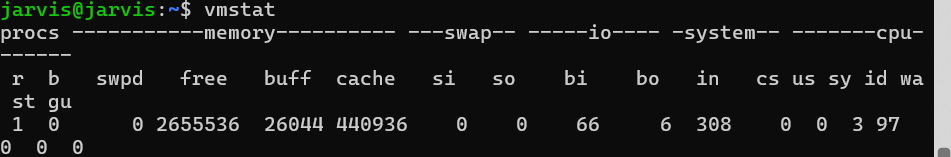
    - dstat
    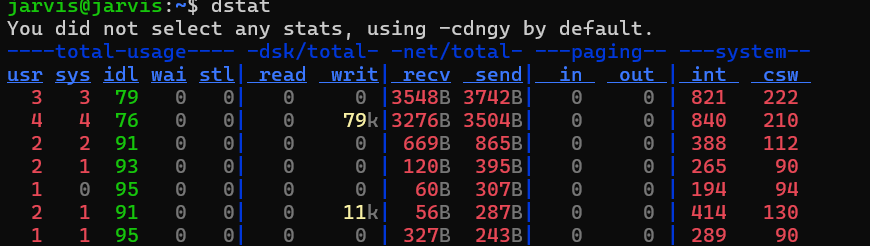

  - **Network (2):** `ss -tulpn`/`netstat -tulpn`, `curl -I <service-endpoint>`/`ping`  
    - ss -tulpn
    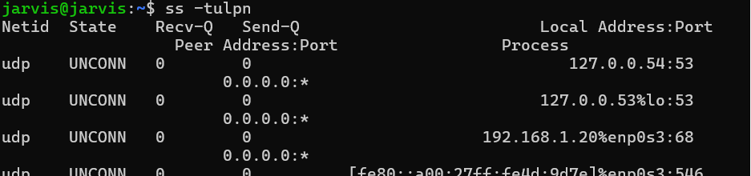
    - netstat -tulpn
    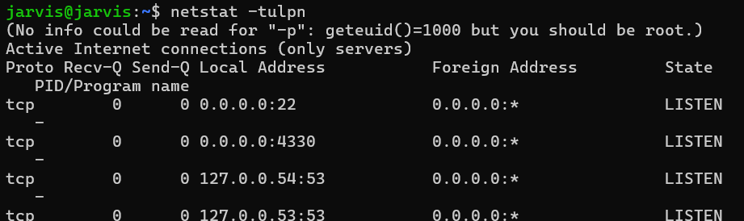
    - curl -I google.com
    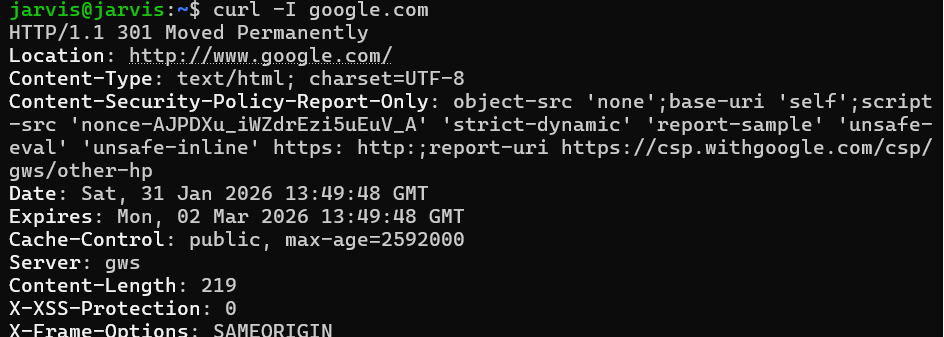

  - **Logs (2):** `journalctl -u <service> -n 50`, `tail -n 50 /var/log/<file>.log`

    - tail -n 50 /var/log/logfilename
    - journalctl -u <service> -n 50