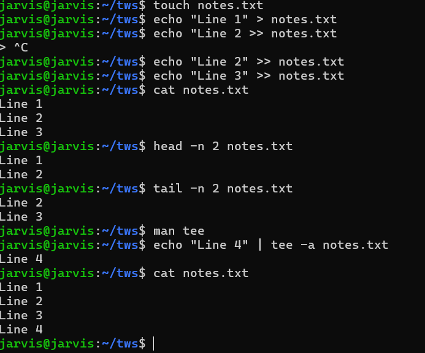

# Day 06 – Linux Fundamentals: Read and Write Text Files

## Task

## Guidelines
Follow these rules while creating your practice note:

- Create a file named `notes.txt`
- Write 3 lines into the file using **redirection** (`>` and `>>`)
- Use **`cat`** to read the full file
- Use **`head`** and **`tail`** to read parts of the file
- Use **`tee`** once to write and display at the same time
- Keep it short (8–12 lines total in the file)

Suggested command flow:
1. `touch notes.txt`
2. `echo "Line 1" > notes.txt`
3. `echo "Line 2" >> notes.txt`
4. `echo "Line 3" | tee -a notes.txt`
5. `cat notes.txt`
6. `head -n 2 notes.txt`
7. `tail -n 2 notes.txt`

