# Day 07 – Linux File System Hierarchy & Scenario-Based Practice

## Task

---


## Guidelines

### Part 1: Linux File System Hierarchy (30 minutes)

Document the purpose of these **essential** directories:

**Core Directories (Must Know):**
- `/` (root) - The starting point of everything
- `/home` - User home directories (where all users lives with their specific directory.)
- `/root` - Root user's home directory
- `/etc` - Configuration files
- `/var/log` - Log files (very important for DevOps!)
- `/tmp` - Temporary files

**Additional Directories (Good to Know):**
- `/bin` - Essential command binaries
- `/usr/bin` - User command binaries
- `/opt` - Optional/third-party applications

For each directory:
- Write 1-2 lines explaining what it contains
- Run `ls -l <directory>` and note 1-2 files/folders you see
  
  My oberservation says that lrwxrwxrwx is a kind of a link
  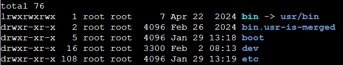
- Write one sentence: "I would use this when..."
  
  Whe I want to see where the file is executable, who is ower,group, and permission of the file/dir.

**Hands-on task:**
```bash
# Find the largest log file in /var/log
du -sh /var/log/* 2>/dev/null | sort -h | tail -5
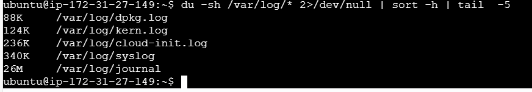
# Look at a config file in /etc
cat /etc/hostname

# Check your home directory
ls -la ~
```

---

### Part 2: Scenario-Based Practice (40 minutes)

**Important:** Focus on understanding the **troubleshooting flow**, not memorizing commands. Use the hints!

---

#### SOLVED EXAMPLE: Understanding How to Approach Scenarios

**Example Scenario: Check if a service is running**
```
Question: How do you check if the 'nginx' service is running?
```

**My Solution (Step by step):**

**Step 1:** Check service status
```bash
systemctl status nginx
```

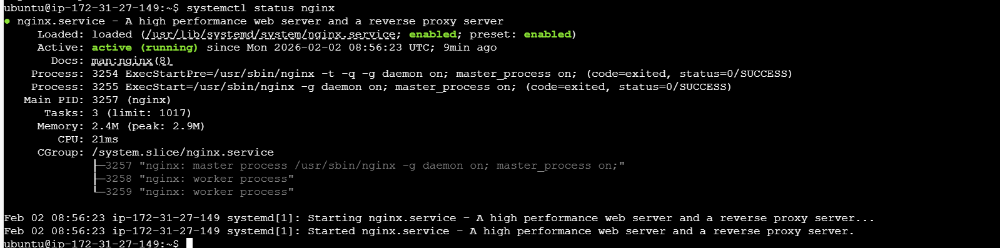

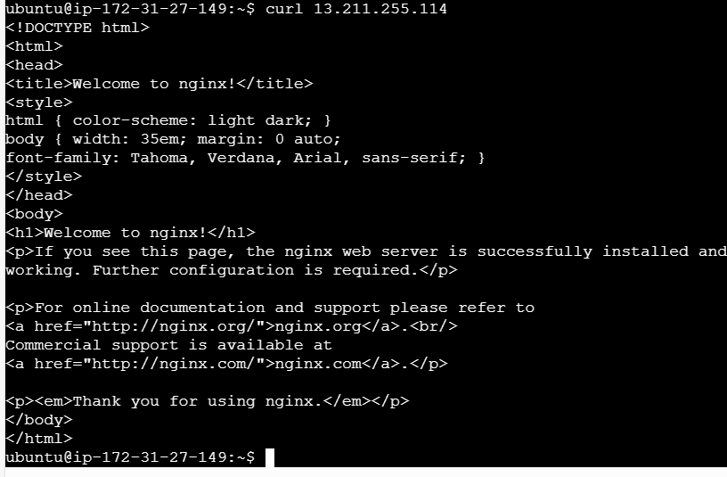

**Why this command?** It shows if the service is active, failed, or stopped

**Step 2:** If service is not found, list all services
```bash
systemctl list-units | grep docker

```
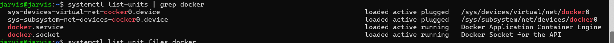

```bash
systemctl list-unit-files | grep docker

```
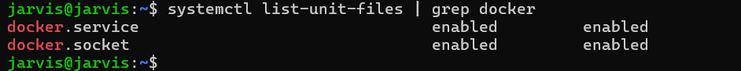

**Why this command?** To see what services exist on the system

**Step 3:** Check if service is enabled on boot
```bash
systemctl is-enabled nginx
```
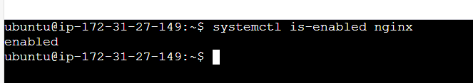
**Why this command?** To know if it will start automatically after reboot

**What I learned:** Always check status first, then investigate based on what you see.

---

Now try these scenarios yourself:

---

**Scenario 1: Service Not Starting** 
```
A web application service called 'myapp' failed to start after a server reboot.
What commands would you run to diagnose the issue?
Write at least 4 commands in order.
```

systemctl status service-name
systemctl is-enable service-name
systemctl list-unit 
**Hint:**
- First check: Is the service running or failed?
- Then check: What do the logs say?
- Finally check: Is it enabled to start on boot?

**Commands to explore:** `systemctl status myapp`, `systemctl is-enabled myapp`, `journalctl -u myapp -n 50`

**Resource:** Review Day 04 (Process and Services practice)

**Template for your answer:**
```
Step 1: [command]
Why: [one line explanation]

Step 2: [command]
Why: [one line explanation]

...
```

---

**Scenario 2: High CPU Usage** 
```
Your manager reports that the application server is slow.
You SSH into the server. What commands would you run to identify
which process is using high CPU?
```


**Hint:**
- Use a command that shows **live** CPU usage
- Look for processes sorted by CPU percentage
- Note the PID (Process ID) of the top process

**Commands to explore:** `top` (press 'q' to quit), `htop`, `ps aux --sort=-%cpu | head -10`
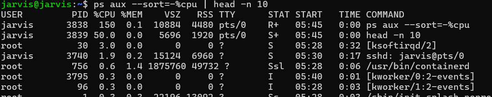

**Resource:** Review Day 05 (Troubleshooting Drill - CPU & Memory section)

---

**Scenario 3: Finding Service Logs** 
```
A developer asks: "Where are the logs for the 'docker' service?"
The service is managed by systemd.
What commands would you use?
```

**Hint:**
- systemd services → logs are in journald
- Command pattern: `journalctl -u <service-name>`
- Use -n flag to limit number of lines
- Use -f flag to follow logs in real-time (like tail -f)

**Commands to explore:**
```bash
# Check service status first
systemctl status ssh
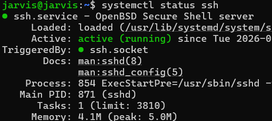
# View last 50 lines of logs
journalctl -u ssh -n 50
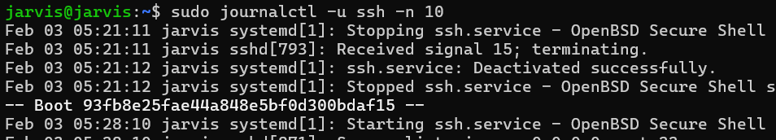

# Follow logs in real-time
journalctl -u ssh -f
```
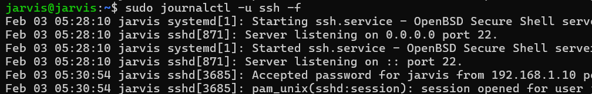

**Resource:** Review Day 04 (Process and Services - Log checks section)

---

**Scenario 4: File Permissions Issue** 
```
A script at /home/user/backup.sh is not executing.
When you run it: ./backup.sh
You get: "Permission denied"

What commands would you use to fix this?
```

**Hint:**
- First: Check what permissions the file has
- Understand: Files need 'x' (execute) permission to run
- Fix: Add execute permission with chmod

**Step-by-step solution structure:**
```
Step 1: Check current permissions
Command: ls -l /home/user/backup.sh
Look for: -rw-r--r-- (notice no 'x' = not executable)

Step 2: Add execute permission
Command: chmod +x /home/user/backup.sh

Step 3: Verify it worked
Command: ls -l /home/user/backup.sh
Look for: -rwxr-xr-x (notice 'x' = executable)

Step 4: Try running it
Command: ./backup.sh
```

**Resource:** Review Day 02 (File Permissions and Users Management)

---
