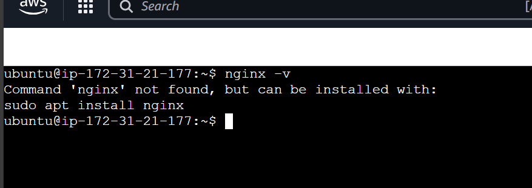
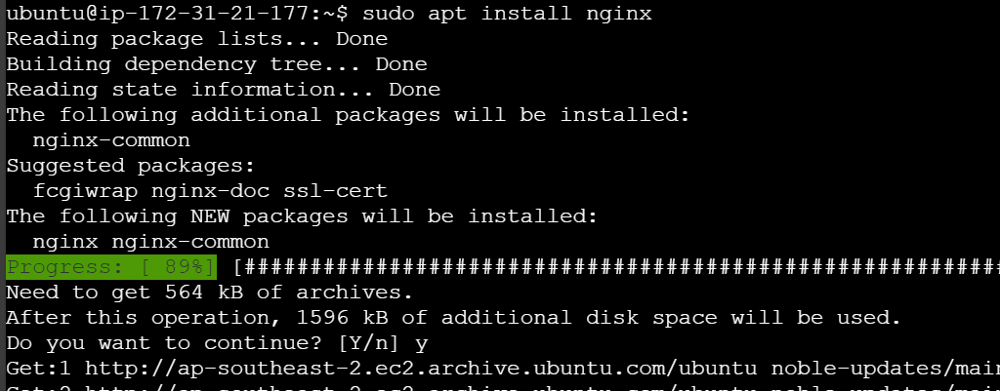
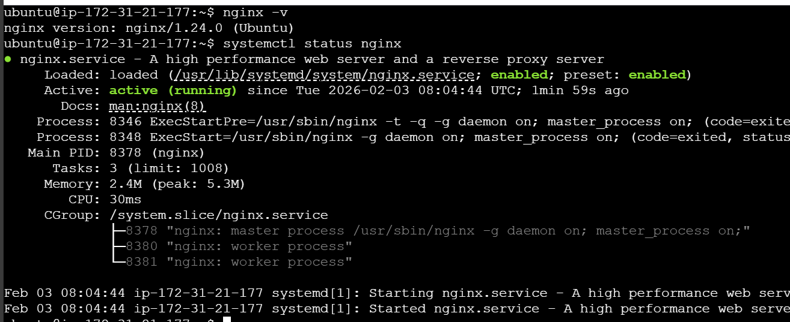
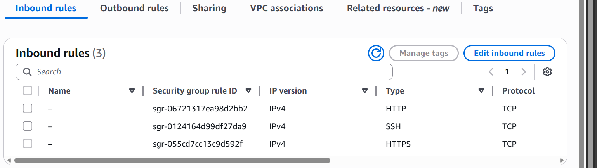
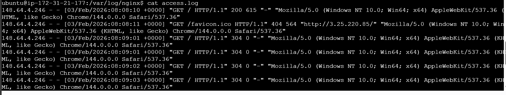
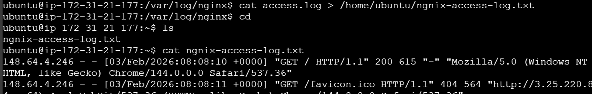
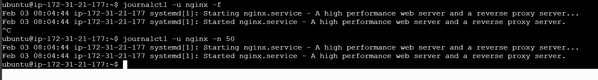
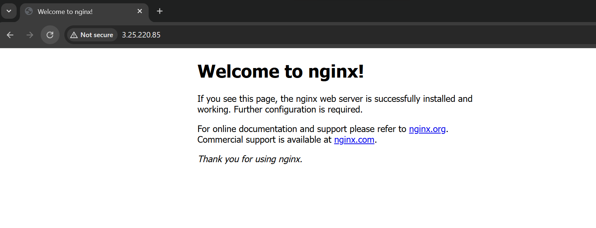

# Day 08 – Cloud Server Setup: Docker, Nginx & Web Deployment

## Task


You will:
- Launch a cloud instance (AWS EC2 or Utho)
- Connect via SSH

- Install Nginx



- Configure security groups for web access (port 80 by default for nginx)

- Extract and save logs to a file





- Verify your webpage is accessible from the internet

This is real DevOps work - exactly what you'll do in production.


## Expected Output
By the end of today, you should have:

1. A markdown file named: `day-08-cloud-deployment.md`
2. Screenshots showing:
   - SSH connection to your server
   - Nginx welcome page accessible from browser
   - Log file contents
3. The log file: `nginx-logs.txt`


---


## Guidelines

### Part 1: Launch Cloud Instance & SSH Access (15 minutes)

**Step 1: Create a Cloud Instance**


**Step 2: Connect via SSH**


---

### Part 2: Install Docker & Nginx (20 minutes)

**Step 1: Update System**


**Step 3: Install Nginx**

**Verify Nginx is running:**

---

### Part 3: Security Group Configuration (10 minutes)

**Test Web Access:**
Open browser and visit: `http://<your-instance-ip>`

You should see the **Nginx welcome page**!

📸 **Screenshot this page** - you'll need it for submission

---

### Part 4: Extract Nginx Logs (15 minutes)

**Step 1: View Nginx Logs**

**Step 2: Save Logs to File**

**Step 3: Download Log File to Your Local Machine**
```bash
# On your local machine (new terminal window)
# For AWS:
scp -i your-key.pem ubuntu@<your-instance-ip>:~/nginx-logs.txt .

# For Utho:
scp root@<your-instance-ip>:~/nginx-logs.txt .
```

---


## Documentation Template

Create your `day-08-cloud-deployment.md` with this structure:

## Commands Used
[List the key commands you used]

## Challenges Faced
[Describe any issues and how you solved them]

## What I Learned
[3-5 bullet points of key learnings]

---
