# Day 09 – Linux User & Group Management Challenge

## Task
---
Figure out how to:
- Create users and set passwords
- Create groups and assign users
- Set up shared directories with group permissions

---

## Challenge Tasks

### Task 1: Create Users (20 minutes)

Create three users with home directories and passwords:
- `tokyo`

- `berlin` Done
- `professor` Done

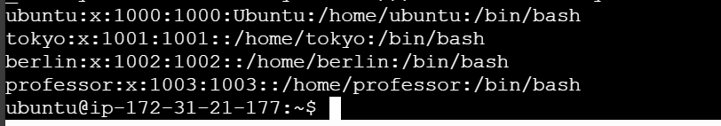
**Verify:** Check `/etc/passwd` and `/home/` directory

---

### Task 2: Create Groups (10 minutes)

Create two groups:
- `developers`
- `admins`

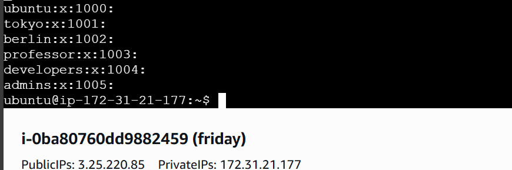
**Verify:** Check `/etc/group`

---

### Task 3: Assign to Groups (15 minutes)

Assign users:
- `tokyo` → `developers`
- `berlin` → `developers` + `admins` (both groups)

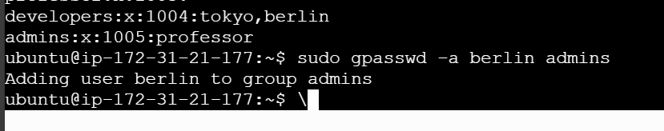
- `professor` → `admins`
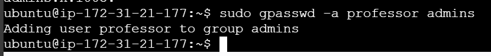

**Verify:** Use appropriate command to check group membership
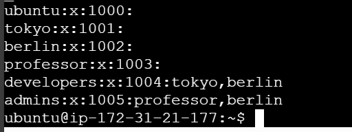
---

### Task 4: Shared Directory (20 minutes)

1. Create directory: `/opt/dev-project`
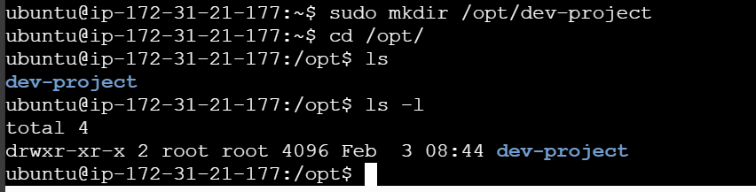
2. Set group owner to `developers`
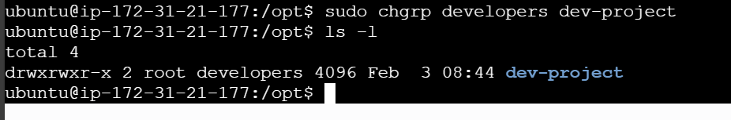
3. Set permissions to `775` (rwxrwxr-x)
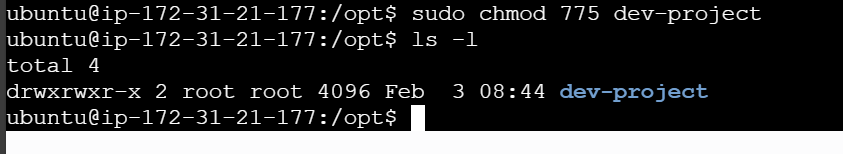
4. Test by creating files as `tokyo` and `berlin`

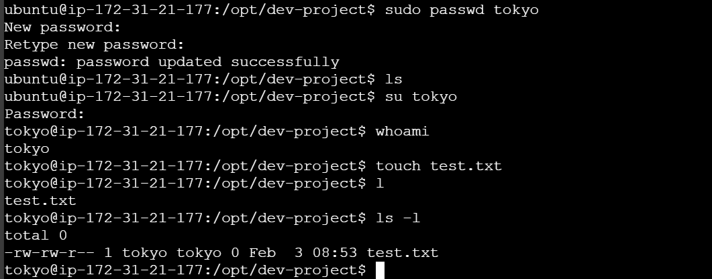

**Verify:** Check permissions and test file creation
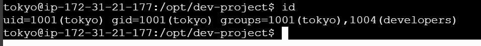
---

### Task 5: Team Workspace (20 minutes)

1. Create user `nairobi` with home directory
2. Create group `project-team`
3. Add `nairobi` and `tokyo` to `project-team`
4. Create `/opt/team-workspace` directory
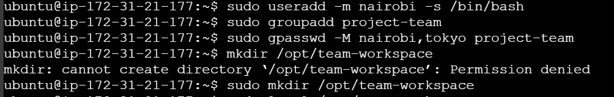
5. Set group to `project-team`, permissions to `775`
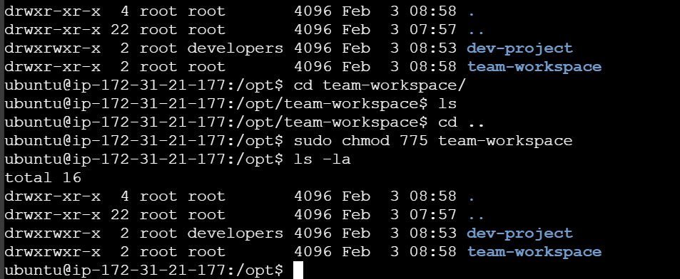

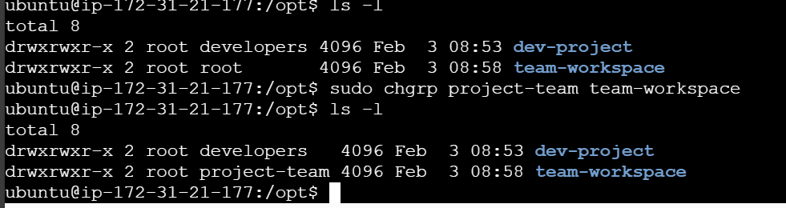
6. Test by creating file as `nairobi`
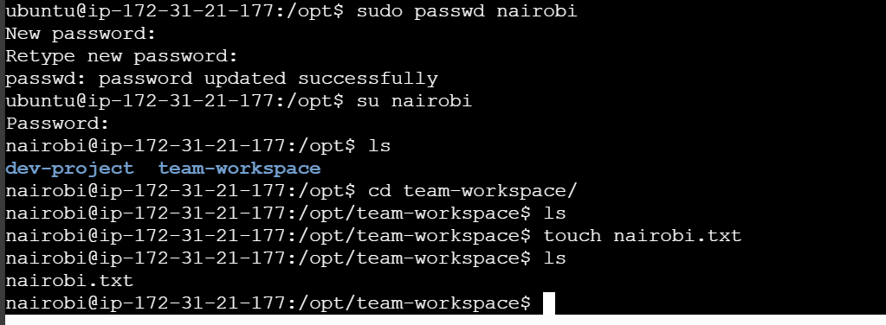
---