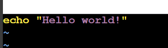
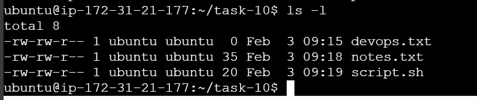
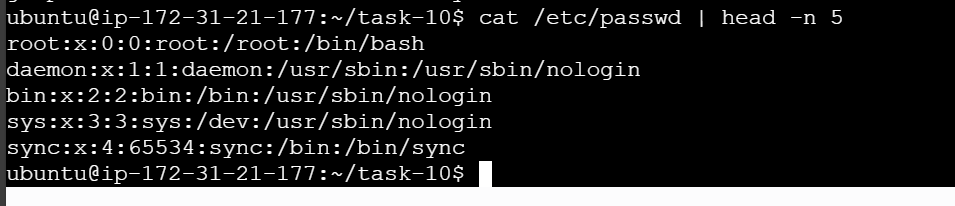
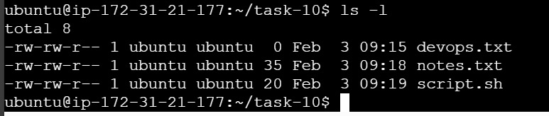
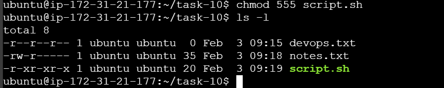
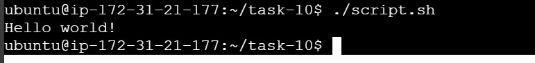
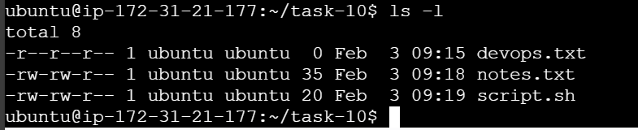

# Day 10 – File Permissions & File Operations Challenge

## Task

---

## Challenge Tasks

### Task 1: Create Files (10 minutes)

1. Create empty file `devops.txt` using `touch`
2. Create `notes.txt` with some content using `cat` or `echo`

3. Create `script.sh` using `vim` with content: `echo "Hello DevOps"`

**Verify:** `ls -l` to see permissions

---

### Task 2: Read Files (10 minutes)

1. Read `notes.txt` using `cat`
2. View `script.sh` in vim read-only mode
3. Display first 5 lines of `/etc/passwd` using `head`

4. Display last 5 lines of `/etc/passwd` using `tail`

---

### Task 3: Understand Permissions (10 minutes)

Format: `rwxrwxrwx` (owner-group-others)
- `r` = read (4), `w` = write (2), `x` = execute (1)

Check your files: `ls -l devops.txt notes.txt script.sh`

Answer: What are current permissions? Who can read/write/execute?

---

### Task 4: Modify Permissions (20 minutes)

1. Make `script.sh` executable → run it with `./script.sh`

2. Set `devops.txt` to read-only (remove write for all)

3. Set `notes.txt` to `640` (owner: rw, group: r, others: none)

4. Create directory `project/` with permissions `755`

**Verify:** `ls -l` after each change

---

### Task 5: Test Permissions (10 minutes)

1. Try writing to a read-only file - what happens?

2. Try executing a file without execute permission

3. Document the error messages

---