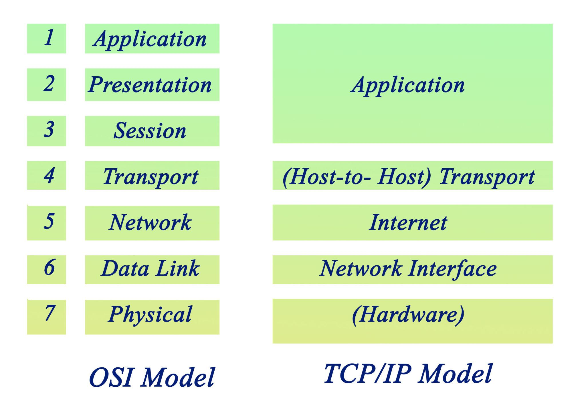
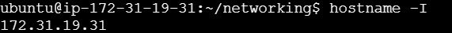
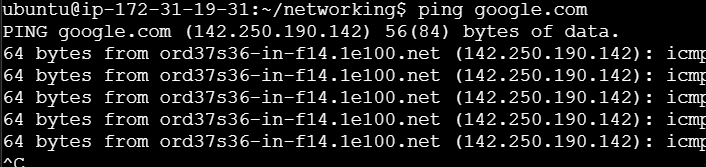
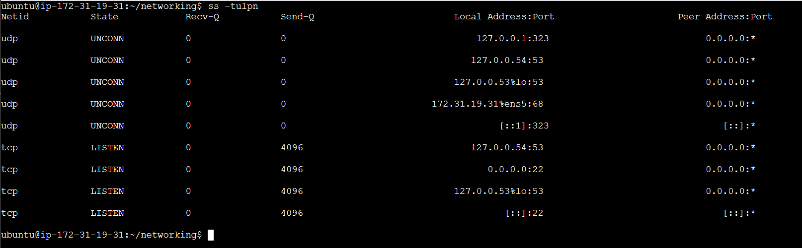
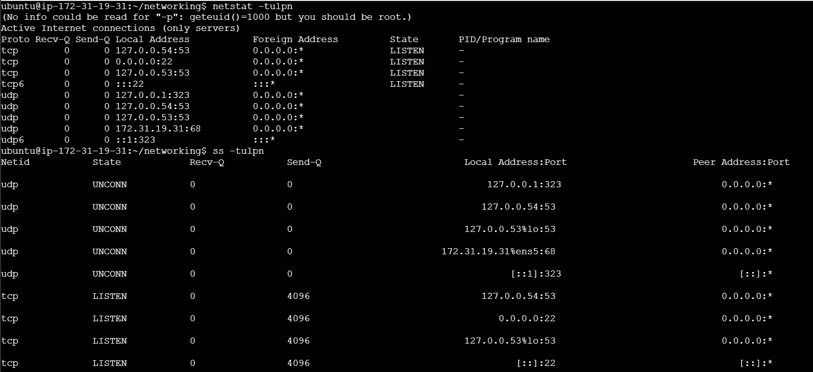
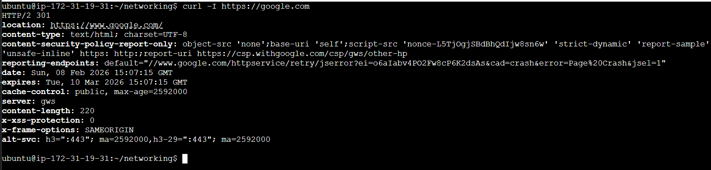

# Day 14 – Networking Fundamentals & Hands-on Checks

## Task

---

## Quick Concepts (write 1–2 bullets each)
- OSI layers (L1–L7) vs TCP/IP stack (Link, Internet, Transport, Application)
A Application layer 7 uses the protocols like HTTP, HTTPS, SSH
P Presentation layer Handles the Encryption and Decryption 
S Session layer 5 Keep the connection alive between the host and client also establishes and terminate
T Transport layer 4 end to end communication, Ports are used by TCP/UDP
N Network layer Handles the routing and logical IP address- router device is used
D Data Link layer 2 MAC address - Flow control between internal connected devices, framing, MAC addressing, error detection 
P phsyical layer 1 hardware physical infrastructure



- Where   sit in the stack
**IP**  Network Layer 3
**TCP/UDP** Transport Layer 4
**HTTP/HTTPS** Application Layer 7
**DNS** Application layer 7 but for DNS use TCP port 53

It mainly uses UDP port 53
Uses TCP port 53 for large responses / zone transfers
 

- One real example: “`curl https://example.com` = App layer over TCP over IP”
- ssh user@server = 👉 Application layer (SSH) over TCP over IP
---

## Hands-on Checklist (run these; add 1–2 line observations)
- **Identity:** `hostname -I` (or `ip addr show`) — note your IP.

- **Reachability:** `ping <target>` — mention latency and packet loss.

- **Path:** `traceroute <target>` (or `tracepath`) — note any long hops/timeouts.


```
ubuntu@ip-172-31-19-31:~/networking$ tracepath google.com
 1?: [LOCALHOST]                      pmtu 9001
 1:  ip-172-31-16-1.us-east-2.compute.internal             0.079ms pmtu 1500
 1:  240.1.248.12                                          9.401ms asymm  5 
 2:  242.5.19.131                                         12.137ms asymm  6 
 3:  151.148.13.56                                         9.409ms asymm  9 
 4:  151.148.13.55                                         8.980ms asymm  6 
 5:  no reply
```
- **Ports:** `ss -tulpn` (or `netstat -tulpn`) — list one listening service and its port.



- **Name resolution:** `dig <domain>` or `nslookup <domain>` — record the resolved IP.
- **HTTP check:** `curl -I <http/https-url>` — note the HTTP status code.


- **Connections snapshot:** `netstat -an | head` — count ESTABLISHED vs LISTEN (rough).

Pick one target service/host (e.g., `google.com`, your lab server, or a local service) and stick to it for ping/traceroute/curl where possible.

---

## Mini Task: Port Probe & Interpret
1) Identify one listening port from `ss -tulpn` (e.g., SSH on 22 or a local web app).  
2) From the same machine, test it: `nc -zv localhost <port>` (or `curl -I http://localhost:<port>`).  
3) Write one line: is it reachable? If not, what’s the next check? (e.g., service status, firewall).

---

## Reflection (add to your markdown)
- Which command gives you the fastest signal when something is broken?
- What layer (OSI/TCP-IP) would you inspect next if DNS fails? If HTTP 500 shows up?
- Two follow-up checks you’d run in a real incident.

---
