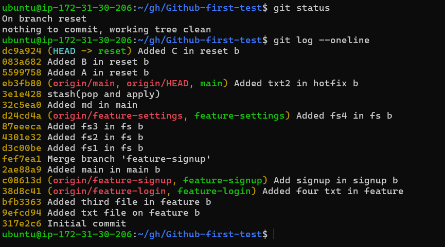
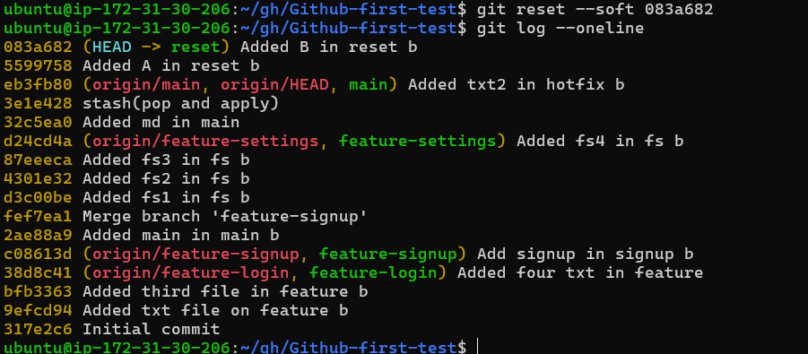
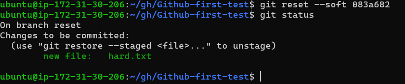
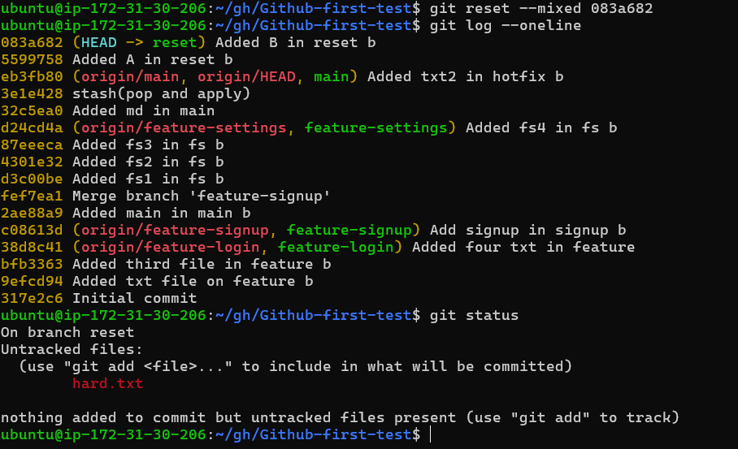
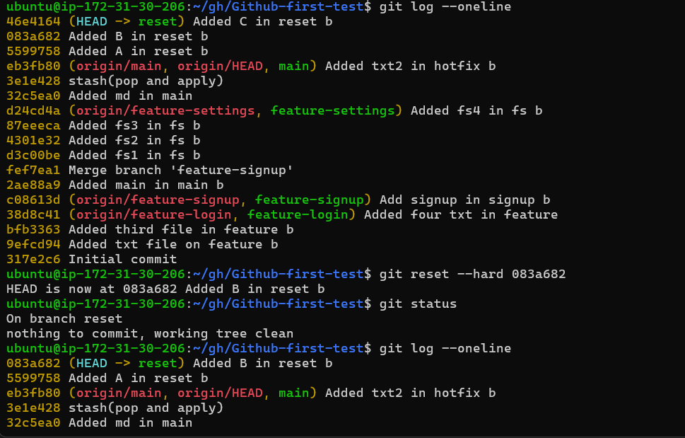
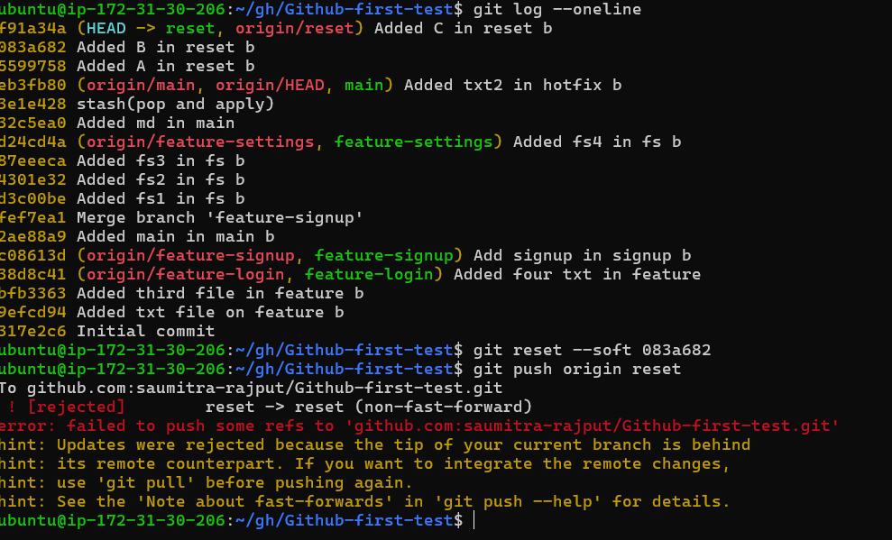
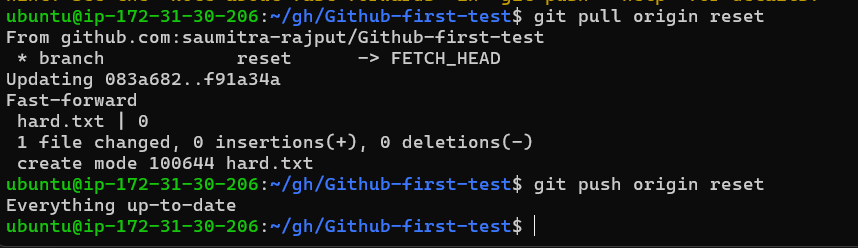
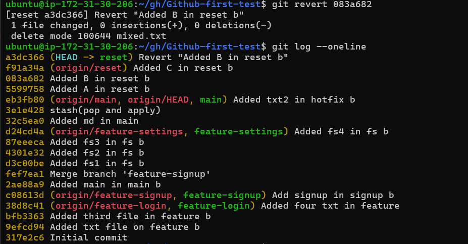
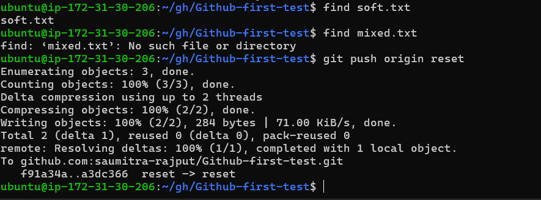

# Day 25 – Git Reset vs Revert & Branching Strategies

## Task

You'll learn how to **undo mistakes** safely — one of the most important skills in Git. You'll also explore **branching strategies** used by real engineering teams to manage code at scale.

---

## Expected Output
- A markdown file: `day-25-notes.md` with your observations and answers
- Continue updating `git-commands.md` in your `devops-git-practice` repo

---

## Challenge Tasks

### Task 1: Git Reset — Hands-On
1. Make 3 commits in your practice repo (commit A, B, C)

2. Use `git reset --soft` to go back one commit — what happens to the changes?

last commit C is gone. and file is stagging area waiting to be committed.

3. Re-commit, then use `git reset --mixed` to go back one commit — what happens now?
 commit is gone and have file in untracked area waiting to be added.
4. Re-commit, then use `git reset --hard` to go back one commit — what happens this time?

commit is gone, working tree is clean, file is gone, nothing in status
5. Answer in your notes:
   - What is the difference between `--soft`, `--mixed`, and `--hard`?
   - Which one is destructive and why? git reset --hard index (because removes everything along with the commit, files, give clean working tree)
   - When would you use each one? 
   - soft for removing commit, keep file in local and stagging
   - mixed for remove commit, keep file, untracked file.
   - hard for remove commit, remove file, clean working tree, no status.
   - Should you ever use `git reset` on commits that are already pushed?
   yes i checked not working
   
   git pull to get the update and then push still not working
   

---

### Task 2: Git Revert — Hands-On
1. Make 3 commits (commit X, Y, Z)
2. Revert commit Y (the middle one) — what happens?
3. Check `git log` — is commit Y still in the history?'


file created on commit b is mixed.txt is gone and push the changes to remote (new commit is created as revert commit b )


4. Answer in your notes:
   - How is `git revert` different from `git reset`?
   - Why is revert considered **safer** than reset for shared branches?
   - When would you use revert vs reset?
Difference
- `git reset`: Rewrites history by moving branch pointer
- `git revert`: Adds a new commit to undo changes (keeps history)

Why revert is safer?
- Does not change history
- Safe for shared/pushed branches
- Doesn’t affect other developers

When to use
- `git reset`: Local changes, before pushing
- `git revert`: Shared branches, team projects

---

### Task 3: Reset vs Revert — Summary
Create a comparison in your notes:

|                | `git reset`                                      | `git revert`                                      |
|----------------|--------------------------------------------------|--------------------------------------------------|
| What it does   | Moves branch pointer to a previous commit        | Creates a new commit to undo changes             |
| Removes commit from history? | Yes (rewrites history)               | No (keeps history intact)                        |
| Safe for shared/pushed branches? | No                                   | Yes                                              |
| When to use    | Undo local commits before pushing                | Undo changes in shared/public branches           |


---

### Task 4: Branching Strategies
Research the following branching strategies and document each in your notes with:
- How it works (short description)
- A simple diagram or flow (text-based is fine)
- When/where it's used
- Pros and cons

1. **GitFlow** — develop, feature, release, hotfix branches 
2. **GitHub Flow** — simple, single main branch + feature branches
3. **Trunk-Based Development** — everyone commits to main, short-lived branches
4. Answer:
   - Which strategy would you use for a startup shipping fast? - Startup: GitHub Flow / Trunk-Based
   - Which strategy would you use for a large team with scheduled releases? - Large team: GitFlow
   - Which one does your favorite open-source project use? (check any repo on GitHub) - Open-source: GitHub Flow

1. GitFlow
- Works: main + develop + feature/release/hotfix
- Flow: feature → develop → release → main
- Use: Large teams, planned releases
- Pros: Structured
- Cons: Complex, slow

---

2. GitHub Flow
- Works: main + feature branches + PR
- Flow: feature → PR → main
- Use: Fast deployments, web apps
- Pros: Simple, fast
- Cons: Less control

---

3. Trunk-Based Development
- Works: Direct commits to main, short branches
- Flow: small commits → main
- Use: CI/CD, fast teams
- Pros: Fast, fewer conflicts
- Cons: Needs strong testing

---

### Task 5: Git Commands Reference Update
Update your `git-commands.md` to cover everything from Days 22–25:
- Setup & Config
```bash
git config --global user.name "Your Name"
git config --global user.email "your@email.com"
git config --list
```
- Basic Workflow (add, commit, status, log, diff)
```
git init
git status
git add .
git commit -m "message"
git log
git diff
```
- Branching (branch, checkout, switch)
```
git branch
git branch feature-name
git checkout feature-name
git switch feature-name
git switch -c new-branch
```
- Remote (push, pull, fetch, clone, fork)
```
git clone <repo-url>
git remote -v
git push origin main
git pull origin main
git fetch
```
- Merging & Rebasing
```
git merge branch-name
git rebase branch-name
```
- Stash & Cherry Pick
```
git stash
git stash pop
git cherry-pick <commit-hash>
```
- Reset & Revert
```
git reset --soft HEAD~1
git reset --hard HEAD~1
git revert <commit-hash>
```
---

## Hints
- `git reflog` is your safety net — it shows everything Git has done, even after a hard reset
- For branching strategies, look at how projects like Kubernetes, React, or Linux kernel manage branches

---

## Submission
1. Add your `day-25-notes.md` to `2026/day-25/`
2. Update `git-commands.md` — commit and push
3. Push to your fork

---

## Learn in Public

Share your Reset vs Revert comparison or your branching strategy notes on LinkedIn.

`#90DaysOfDevOps` `#DevOpsKaJosh` `#TrainWithShubham`

Happy Learning!
**TrainWithShubham**
