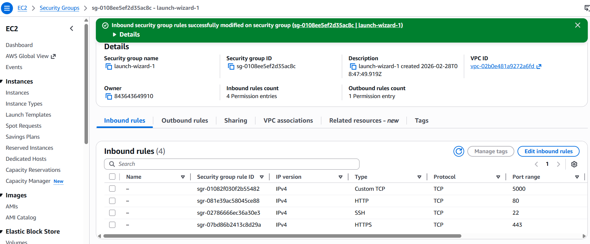
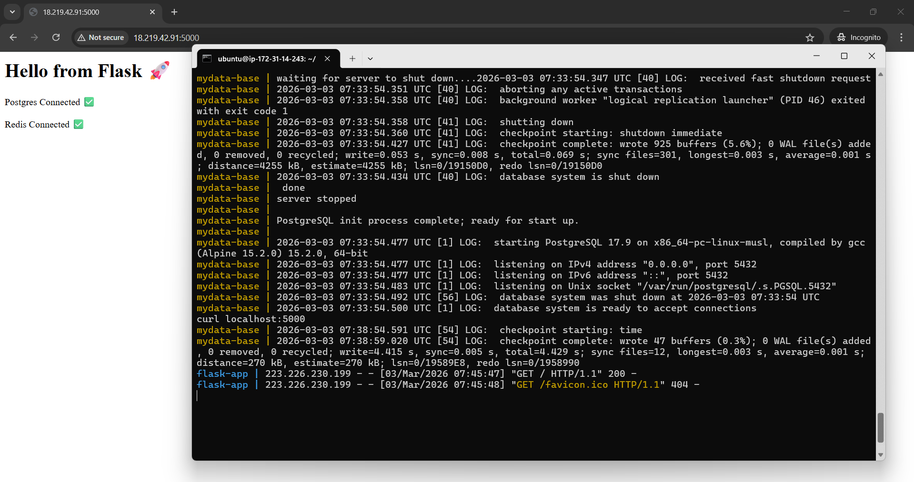
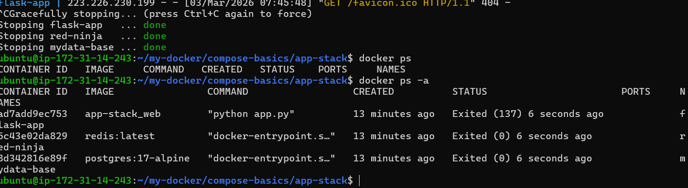
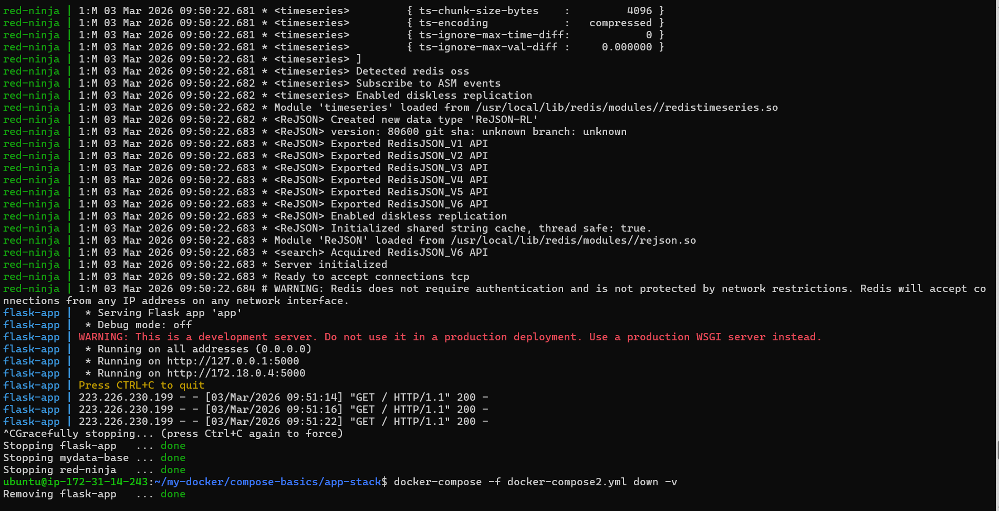
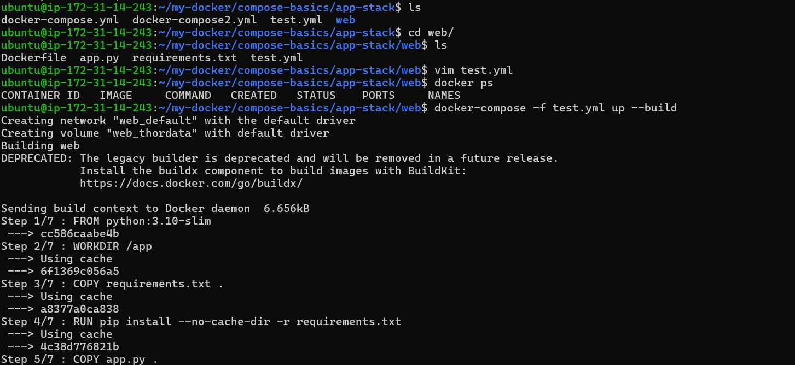
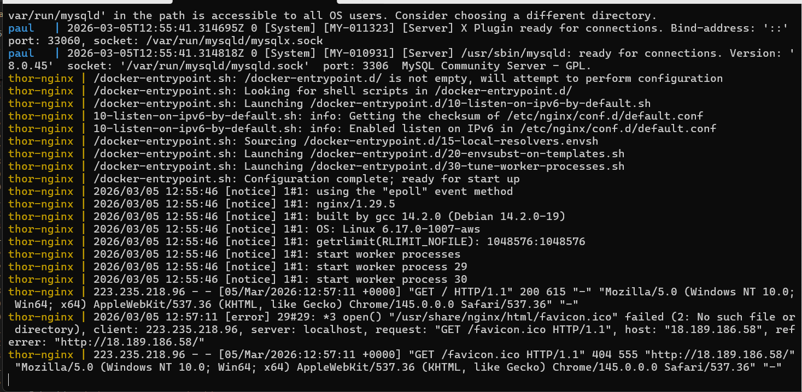
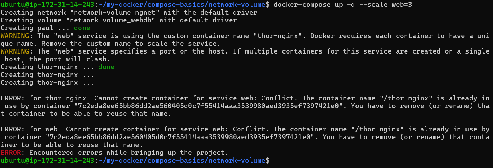

# Day 34 – Docker Compose: Real-World Multi-Container Apps

## Task
Today's goal is to **build more complex, production-like setups with Docker Compose**.

Yesterday was basics. Today you handle real scenarios — app + database + cache, healthchecks, restart policies, and service dependencies.

---

## Challenge Tasks

### Task 1: Build Your Own App Stack
Create a `docker-compose.yml` for a 3-service stack:
- A **web app** (use Python Flask, Node.js, or any language you know)
- A **database** (Postgres or MySQL)
- A **cache** (Redis)


Write a simple Dockerfile for the web app. The app doesn't need to be complex — even a "Hello World" that connects to the database is enough.
- mapped on port : 5000
- enabled port: 5000 on instance

- working fine

- stopping containers

---

### Task 2: depends_on & Healthchecks
1. Add `depends_on` to your compose file so the app starts **after** the database
2. Add a **healthcheck** on the database service
3. Use `depends_on` with `condition: service_healthy` so the app waits for the database to be truly ready, not just started

**Test:** Bring everything down and up — does the app wait for the DB?

- created new file with the healthcheck conditon - docker-compose2.yml
- using flag -f to select the file which we wants to execute
```
docker-compose -f docker-compose.yml down -v
```
- running new file docker-compose2.yml
```
docker-compose -f docker-compose2.yml up --build
```
in -d background deamon
```
docker-compose -f docker-compose2.yml up --build -d
```


- all good fixed the error : FATAL:  database "jarvis" does not exist 
- solution: added database in healthcheck ``` healthcheck:
  test: ["CMD-SHELL", "pg_isready -U jarvis -d mydb"]```


---

### Task 3: Restart Policies
1. Add `restart: always` to your database service
- Add restart: always
2. Manually kill the database container — does it come back?
- docker kill mydb
- Container restarts automatically because of restart: always.
3. Try `restart: on-failure` — how is it different?
- Restarts only if container crashes

- Does not restart if stopped manually

4. Write in your notes: When would you use each restart policy?

- Restart Policies

restart: always

Use for critical services that must always stay running.

- Databases
- Redis
- APIs
- Critical services

restart: on-failure

Use for containers that should restart only when they fail.

- Batch jobs
- Workers
- Background processing tasks
---

### Task 4: Custom Dockerfiles in Compose
1. Instead of using a pre-built image for your app, use `build:` in your compose file to build from a Dockerfile
2. Make a code change in your app
3. Rebuild and restart with one command


---

### Task 5: Named Networks & Volumes
1. Define **explicit networks** in your compose file instead of relying on the default
2. Define **named volumes** for database data
3. Add **labels** to your services for better organization

all done:

---

### Task 6: Scaling (Bonus)
1. Try scaling your web app to 3 replicas using `docker compose up --scale`
2. What happens? What breaks?
3. Write in your notes: Why doesn't simple scaling work with port mapping?

---

## Hints
- Build from Dockerfile: `build: ./app`
- Healthcheck: `healthcheck:` with `test`, `interval`, `timeout`
- Rebuild: `docker compose up --build`
- Scale: `docker compose up --scale web=3`

Because web cont1 is mapped to port 80, other cont2, cont3 do not have port mapping define in yml
- 

Takeaway: multiple containers cannot bind to the same host port. Only one container can expose a specific host port.
---


## Submission
1. Add your compose files, Dockerfiles, and `day-34-compose-advanced.md` to `2026/day-34/`
2. Commit and push to your fork

---

## Learn in Public
Share your 3-service app stack running via Compose on LinkedIn.

`#90DaysOfDevOps` `#DevOpsKaJosh` `#TrainWithShubham`

Happy Learning!
**TrainWithShubham**
