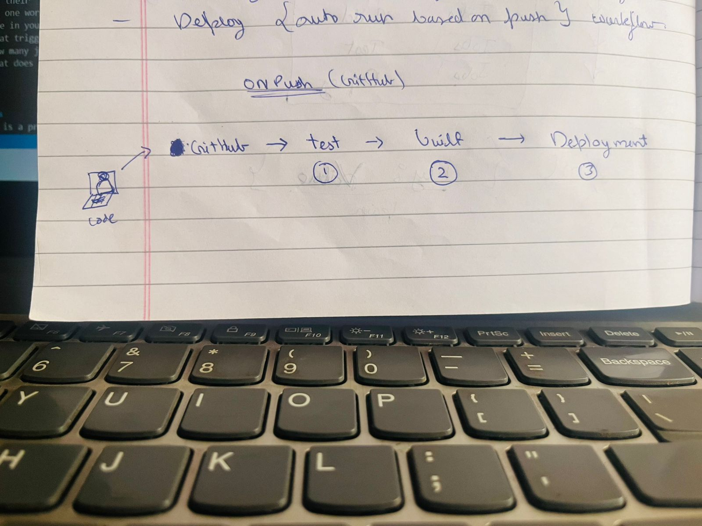

# Day 39 – What is CI/CD?

## Task
Before writing a single pipeline, understand **why CI/CD exists** and what it actually does.

Today is a research and diagram day — no pipelines yet. Get the concepts right first.

---

## Expected Output
- A markdown file: `day-39-cicd-concepts.md`
- A pipeline diagram (hand-drawn or text-based)

---

## Challenge Tasks

### Task 1: The Problem
Think about a team of 5 developers all pushing code to the same repo manually deploying to production.

Write in your notes:
1. What can go wrong?
- multi features, commit, different types of code, different build and dependencies
2. What does "it works on my machine" mean and why is it a real problem?
- It works on my machine” means code works locally but fails elsewhere due to environment differences.
3. How many times a day can a team safely deploy manually?
- Manual deployments usually allow 1–2 deployments per day, while CI/CD enables many deployments per day safely

---

### Task 2: CI vs CD
Research and write short definitions (2-3 lines each):
1. **Continuous Integration** — what happens, how often, what it catches
- Developers frequently merge code into a shared repository. Each commit triggers automatic builds and tests. It catches integration issues and bugs early.
2. **Continuous Delivery** — how it's different from CI, what "delivery" means
- when you manually run the workflow.
- After CI tests pass, the application is automatically prepared for release. Deployment to production is manual. The software is always ready to deploy.
3. **Continuous Deployment** — how it differs from Delivery, when teams use it
- when the workflow is auto run on push or deployment.
- Every change that passes tests is automatically deployed to production. No manual approval is required. Used when teams have strong automated testing and monitoring.

Write one real-world example for each.
### 1️⃣ Continuous Integration (CI)
Example: Developers push code to GitHub, and GitHub Actions/Jenkins automatically builds the application and runs tests to check if the new code breaks anything.

### 2️⃣ Continuous Delivery (CD)
Example: After CI tests pass, the application is automatically built and deployed to a staging environment, and a manager clicks “Deploy to Production” when ready.

### 3️⃣ Continuous Deployment
Example: A company like Netflix automatically deploys code to production after tests pass, so new updates reach users multiple times a day without manual approval.

---

### Task 3: Pipeline Anatomy
A pipeline has these parts — write what each one does:
- **Trigger** — what starts the pipeline
    - A trigger starts the pipeline automatically when an event happens, such as a code push, pull request, or scheduled run.
- **Stage** — a logical phase (build, test, deploy)
    - A stage is a major phase of the pipeline like build, test, or deploy, grouping related jobs together.
- **Job** — a unit of work inside a stage
    - A job is a set of tasks executed within a stage. Jobs usually run on a runner and perform specific work like compiling code or running tests.
- **Step** — a single command or action inside a job
    - A step is a single command or action inside a job, such as running a script, installing dependencies, or executing tests.
- **Runner** — the machine that executes the job
    - A runner is the machine (server or VM) that executes pipeline jobs and performs the steps defined in the pipeline.
- **Artifact** — output produced by a job
    - An artifact is a file or output produced by a job, such as build packages, logs, or compiled applications, which can be used in later stages.

---

### Task 4: Draw a Pipeline
Draw a CI/CD pipeline for this scenario:
> A developer pushes code to GitHub. The app is tested, built into a Docker image, and deployed to a staging server.

Include at least 3 stages. Hand-drawn and photographed is perfectly fine.

---

### Task 5: Explore in the Wild
1. Open any popular open-source repo on GitHub (Kubernetes, React, FastAPI — pick one you know)
2. Find their `.github/workflows/` folder
3. Open one workflow YAML file
4. Write in your notes:
   - What triggers it?
     - Issue format Code review
   - How many jobs does it have?
     - 4 jobs
   - What does it do? (best guess)
     - reviewing the code
---

## Hints
- CI/CD is a practice, not just a tool
- GitHub Actions, Jenkins, GitLab CI, CircleCI — all are tools that implement CI/CD
- A pipeline failing is not a problem — it's CI/CD doing its job

---

## Documentation
Create `day-39-cicd-concepts.md` with:
- Your CI vs CD vs CD definitions
- Pipeline anatomy notes
- Your pipeline diagram
- What you found in the open-source repo

---

## Submission
1. Add your `day-39-cicd-concepts.md` to `2026/day-39/`
2. Commit and push to your fork

---

## Learn in Public
Share your pipeline diagram on LinkedIn — even a rough hand-drawn one gets engagement.

`#90DaysOfDevOps` `#DevOpsKaJosh` `#TrainWithShubham`

Happy Learning!
**TrainWithShubham**
