# Day 42 – Runners: GitHub-Hosted & Self-Hosted

## Task
Every job needs a machine to run on. Today you understand **runners** — GitHub's hosted ones and how to set up your own self-hosted runner on a real server.

---

## Expected Output
- A self-hosted runner registered to your GitHub repo
- A workflow that runs a job on your self-hosted runner
- A markdown file: `day-42-runners.md`

---

## Challenge Tasks

### Task 1: GitHub-Hosted Runners
1. Create a workflow with 3 jobs, each on a different OS:
   - `ubuntu-latest`
   - `windows-latest`
   - `macos-latest`
2. In each job, print:
   - The OS name
   - The runner's hostname
   - The current user running the job
3. Watch all 3 run in parallel

Write in your notes: What is a GitHub-hosted runner? Who manages it?

---

### Task 2: Explore What's Pre-installed
1. On the `ubuntu-latest` runner, run a step that prints:
   - Docker version
   - Python version
   - Node version
   - Git version
2. Look up the GitHub docs for the full list of pre-installed software on `ubuntu-latest`

Write in your notes: Why does it matter that runners come with tools pre-installed?

---

### Task 3: Set Up a Self-Hosted Runner
1. Go to your GitHub repo → Settings → Actions → Runners → **New self-hosted runner**
2. Choose Linux as the OS
3. Follow the instructions to download and configure the runner on:
   - Your local machine, OR
   - A cloud VM (EC2, Utho, or any VPS)

   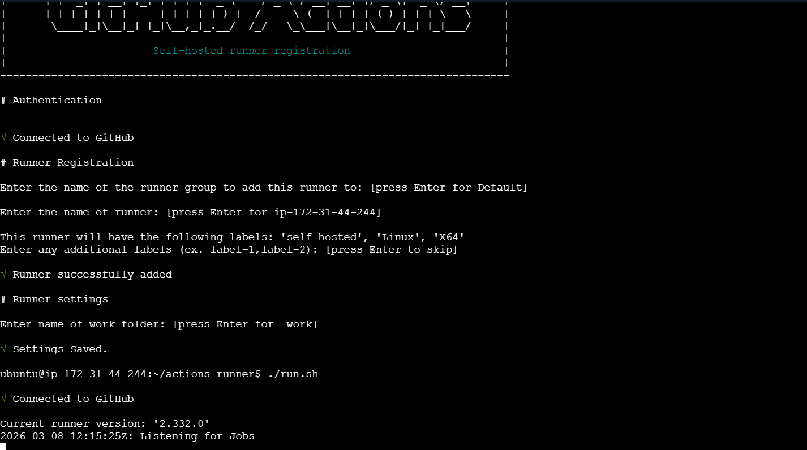
4. Start the runner — verify it shows as **Idle** in GitHub

**Verify:** Your runner appears in the Runners list with a green dot.

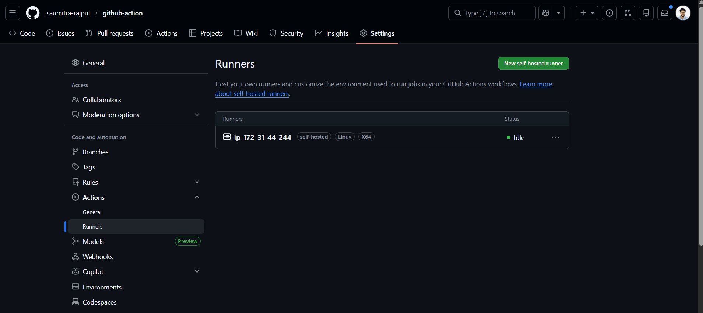
---

### Task 4: Use Your Self-Hosted Runner
1. Create `.github/workflows/self-hosted.yml`
2. Set `runs-on: self-hosted`
3. Add steps that:
   - Print the hostname of the machine (it should be YOUR machine/VM)
   - Print the working directory
   - Create a file and verify it exists on your machine after the run
4. Trigger it and watch it run on your own hardware

**Verify:** Check your machine — is the file there?

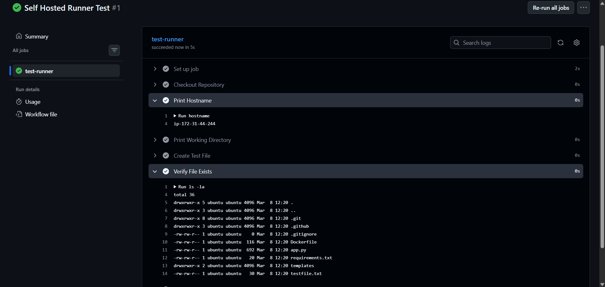
---

### Task 5: Labels
1. Add a **label** to your self-hosted runner (e.g., `my-linux-runner`)

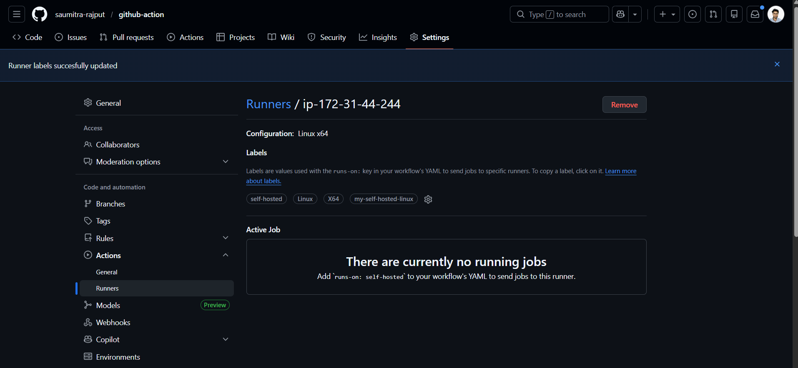
2. Update your workflow to use `runs-on: [self-hosted, my-linux-runner]`
3. Trigger it — does it still pick up the job?

- All the jobs worked
- Run the multiple workflow to test the runner it took sometime but worked

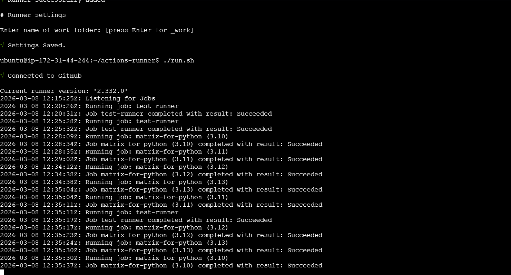

Write in your notes: Why are labels useful when you have multiple self-hosted runners?

Labels help control which runner executes a job when you have many self-hosted runners.

They allow you to:

- Direct jobs to specific machines

- Separate runners by OS

- Separate runners by hardware

- Separate runners by environment
---

### Task 6: GitHub-Hosted vs Self-Hosted
Fill this in your notes:

| | GitHub-Hosted | Self-Hosted |
|---|---|---|
| Who manages it? | ? | ? |
| Cost | ? | ? |
| Pre-installed tools | ? | ? |
| Good for | ? | ? |
| Security concern | ? | ? |

---

## Hints
- Runner setup script is generated by GitHub — just copy and run it
- Self-hosted runner runs as a background service: `./run.sh`
- To run as a service (persistent): `sudo ./svc.sh install && sudo ./svc.sh start`
- `runs-on: self-hosted` targets any self-hosted runner
- `runs-on: [self-hosted, linux, my-label]` targets specific ones

---

## Documentation
Create `day-42-runners.md` with:
- Screenshot of your self-hosted runner showing as Idle in GitHub
- Screenshot of a job running on your self-hosted runner
- The comparison table from Task 6

---

## Submission
1. Add `day-42-runners.md` to `2026/day-42/`
2. Commit and push to your fork

---

## Learn in Public
Share your self-hosted runner screenshot on LinkedIn — running CI on your own machine is a cool flex.

`#90DaysOfDevOps` `#DevOpsKaJosh` `#TrainWithShubham`

Happy Learning!
**TrainWithShubham**

- Code structure.
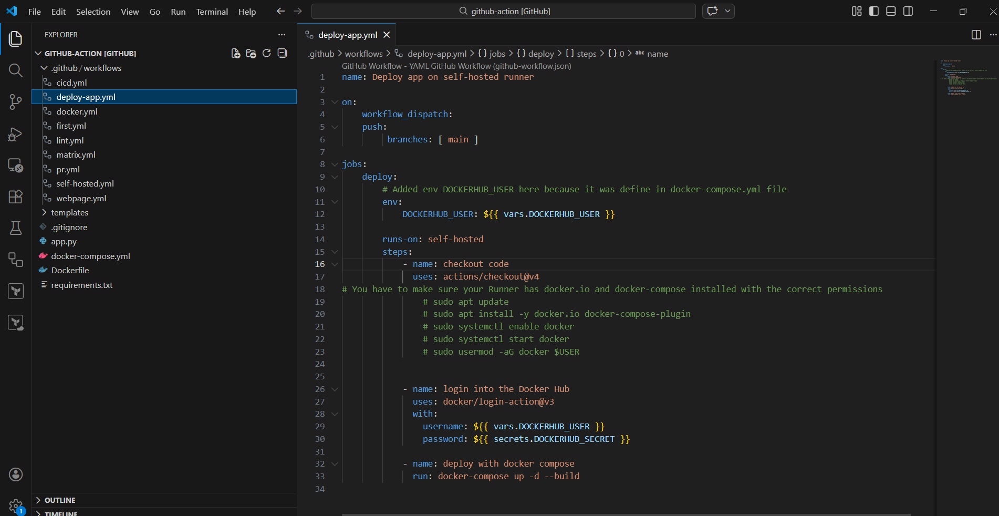
- Bugs In Actions.
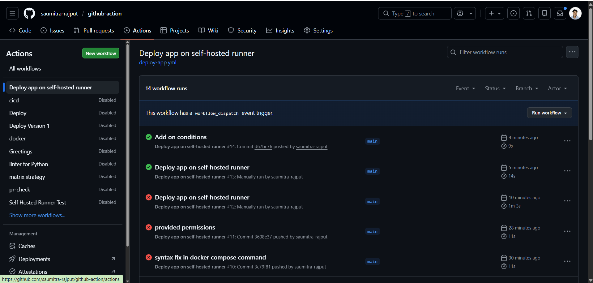
- Action workflow succeeded.
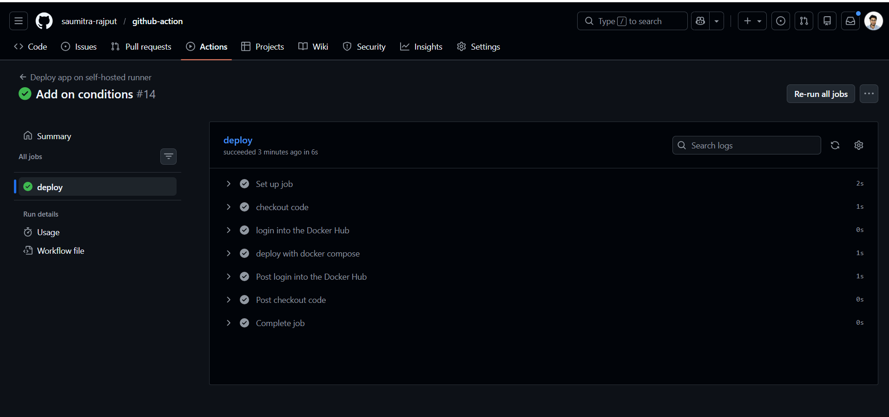
- Self hosted runner jobs logs.
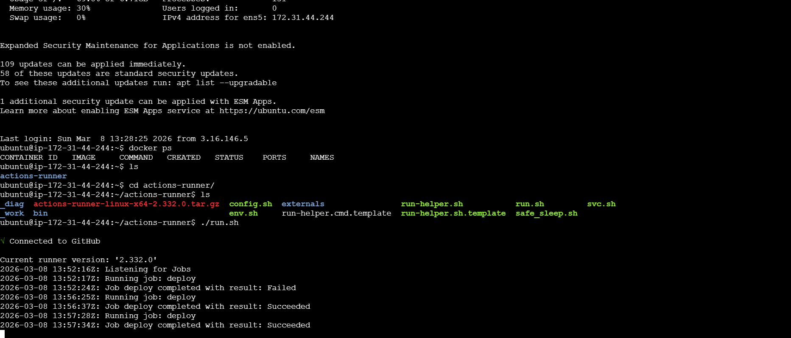
- Deploy on self hosted Runner successfully.
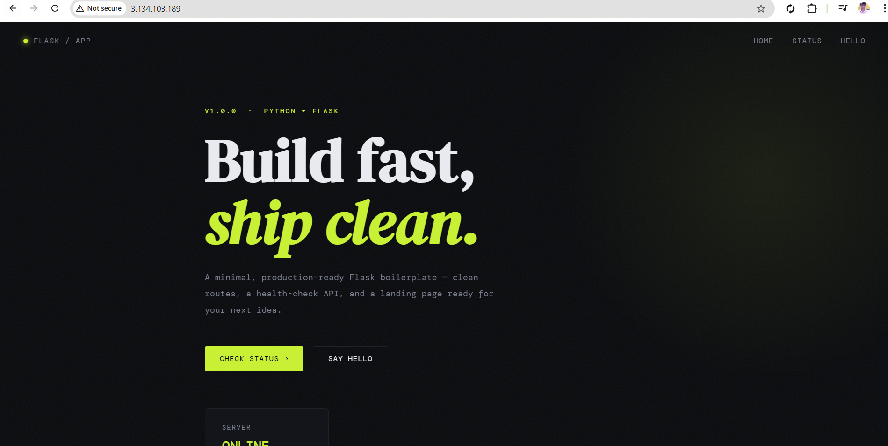

- Updated further Now it will first build the and push to docker hub with the latest changes.
- Then Once the build and push job is completed it will run the Deploy job automatically.
- Workflow Actions
   - Firstly Build and push run successfully.
   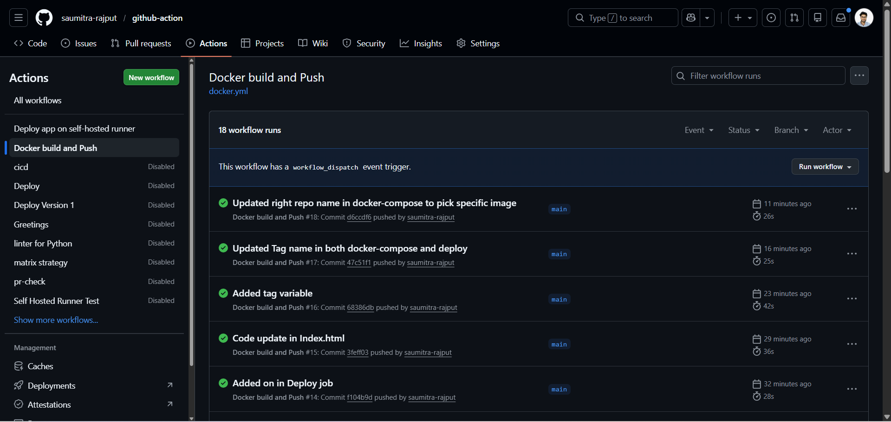

   - Second Once BuildnPush is completed Deploy Action got triggered.
   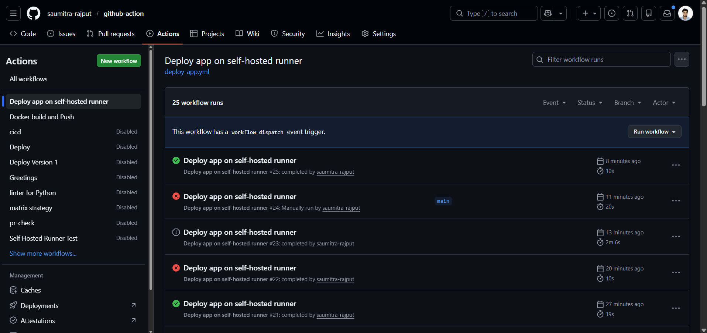

- Updated code image is Build and push to Docker Hub then Deploy on Docker Container with the Changes
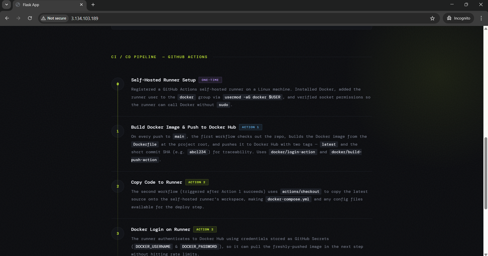