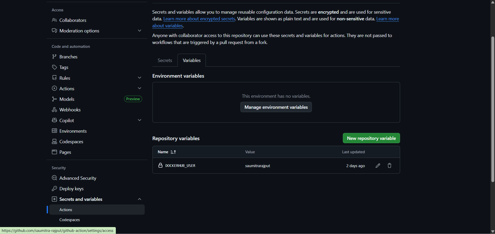
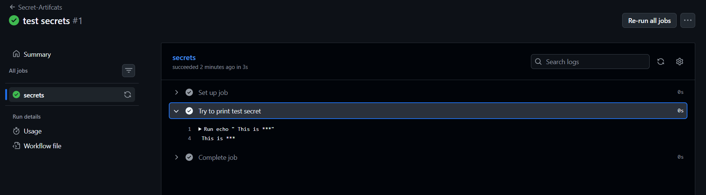
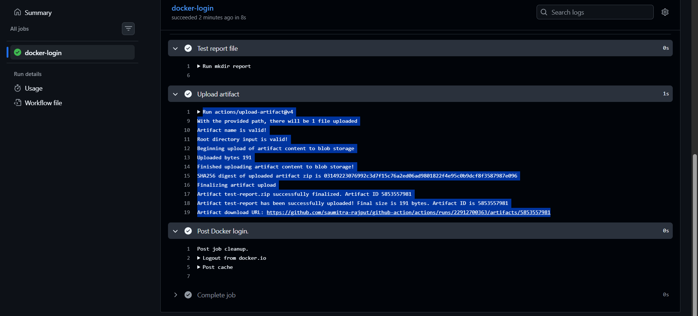
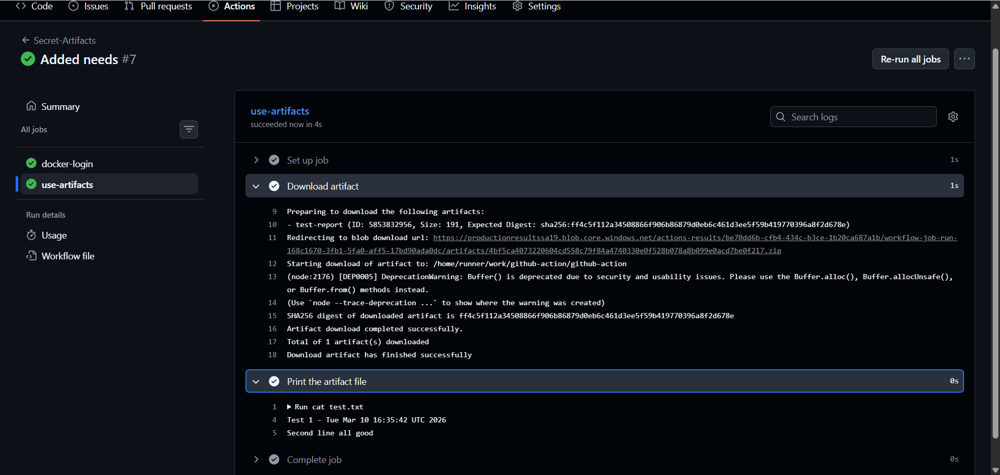
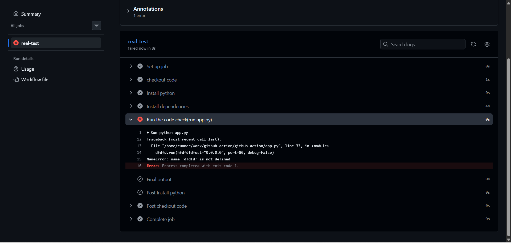
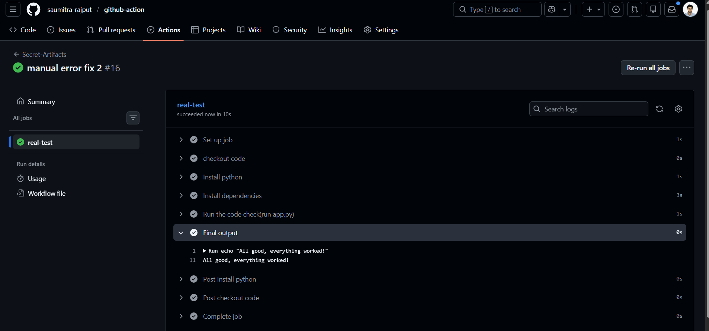

# Day 44 – Secrets, Artifacts & Running Real Tests in CI

## Task
Today your pipeline starts doing **real work** — storing sensitive values securely, saving build outputs, and running actual tests from your previous days.

---

## Challenge Tasks

### Task 1: GitHub Secrets
1. Go to your repo → Settings → Secrets and Variables → Actions

2. Create a secret called `MY_SECRET_MESSAGE`
3. Create a workflow that reads it and prints: `The secret is set: true` (never print the actual value)
4. Try to print `${{ secrets.MY_SECRET_MESSAGE }}` directly — what does GitHub show?

- GitHub mask the secrets even pushed in code

Write in your notes:

- You should never print secrets in CI logs because logs are often visible, stored, and shared, which can expose sensitive credentials.
🔐 Logs are visible to repository collaborators (sometimes public).

📁 Logs are stored for a long time, so leaked secrets remain accessible.

🔗 Logs may be shared in bug reports, monitoring tools, or chats.

🤖 Attackers scan logs automatically for API keys and tokens.

⚠️ Secret exposure can compromise systems (cloud accounts, databases, APIs).

🛡️ Best practice: use secrets internally in CI, never print them in logs.

---

### Task 2: Use Secrets as Environment Variables
1. Pass a secret to a step as an environment variable
2. Use it in a shell command without ever hardcoding it
3. Add `DOCKER_USERNAME` and `DOCKER_TOKEN` as secrets (you'll need these on Day 45)

---

### Task 3: Upload Artifacts
1. Create a step that generates a file — e.g., a test report or a log file
2. Use `actions/upload-artifact` to save it
3. After the workflow runs, download the artifact from the Actions tab

**Verify:** Can you see and download it from GitHub?
- Artifacts are stored for 90 days by default.
- 

---

### Task 4: Download Artifacts Between Jobs
1. Job 1: generate a file and upload it as an artifact
2. Job 2: download the artifact from Job 1 and use it (print its contents)

Write in your notes: When would you use artifacts in a real pipeline?

**Artifacts in CI/CD Pipelines**

When are artifacts used?

Artifacts are used when files need to be **passed between jobs** or **saved after a workflow run**.

Common Use Cases

- 📦 **Build → Test → Deploy Pipelines**
  - Job 1: Build the application
  - Job 2: Test the built package
  - Job 3: Deploy the same package

- 📊 **Test Reports**
  - Store test results
  - Code coverage reports
  - Logs for later download

- 🐳 **Build Outputs**
  - Compiled binaries
  - JAR/WAR files
  - Frontend build folders (`dist/`, `build/`)

- 🔍 **Debugging**
  - Upload logs
  - Crash reports
  - Failure artifacts for troubleshooting

---

### Task 5: Run Real Tests in CI
Take any script from your earlier days (Python or Shell) and run it in CI:
1. Add your script to the `github-actions-practice` repo
2. Write a workflow that:
   - Checks out the code
   - Installs any dependencies needed
   - Runs the script
   - Fails the pipeline if the script exits with a non-zero code
3. Intentionally break the script — verify the pipeline goes red

4. Fix it — verify it goes green again

---

### Task 6: Caching
1. Add `actions/cache` to a workflow that installs dependencies
2. Run it twice — observe the time difference
3. Write in your notes: What is being cached and where is it stored?

need to practice demo

---

## Hints
- Secrets: `${{ secrets.SECRET_NAME }}`
- Upload artifact: `uses: actions/upload-artifact@v4`
- Download artifact: `uses: actions/download-artifact@v4`
- Cache: `uses: actions/cache@v4`
- GitHub masks secret values in logs automatically

---

## Documentation
Create `day-44-secrets-artifacts.md` with:
- Screenshots of artifact download
- Screenshot of your passing test run
- What you learned about secrets management

---

## Submission
1. Add `day-44-secrets-artifacts.md` to `2026/day-44/`
2. Commit and push to your fork

---

## Learn in Public
Share your first real test run passing in CI on LinkedIn.

`#90DaysOfDevOps` `#DevOpsKaJosh` `#TrainWithShubham`

Happy Learning!
**TrainWithShubham**
