# Day 64 -- Terraform State Management and Remote Backends

## Task
The state file is the single most important thing in Terraform. It is the source of truth -- the map between your `.tf` files and what actually exists in the cloud. Lose it and Terraform forgets everything. Corrupt it and your next apply could destroy production.

Today you learn to manage state like a professional -- remote backends, locking, importing existing resources, and handling drift.

---

## Expected Output
- Terraform state migrated from local to S3 remote backend with DynamoDB locking
- An existing AWS resource imported into Terraform state
- State drift simulated and reconciled
- A markdown file: `day-64-state-management.md`

---

## Challenge Tasks

### Task 1: Inspect Your Current State
Use your Day 63 config (or create a small config with a VPC and EC2 instance). Apply it and then explore the state:

```bash
terraform show                                    # Full state in human-readable format
terraform state list                              # All resources tracked by Terraform
terraform state show aws_instance.<name>          # Every attribute of the instance
terraform state show aws_vpc.<name>               # Every attribute of the VPC
```
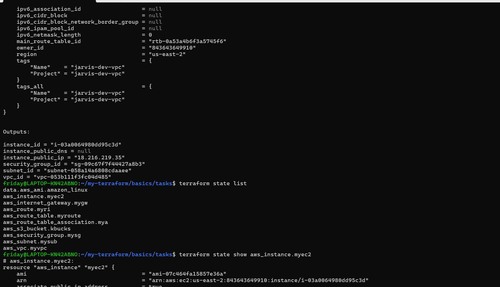
Answer:
1. How many resources does Terraform track?

Terraform tracks all created resources in state

2. What attributes does the state store for an EC2 instance? (hint: way more than what you defined)

State contains full resource details (not just your config)

3. Open `terraform.tfstate` in an editor -- find the `serial` number. What does it represent?

serial = version number of the state file
the serial number is a version counter for the state file
It increments every time Terraform updates the state

👉 Purpose:

Helps Terraform detect changes between state versions
Prevents conflicts when multiple updates happen

---

### Task 2: Set Up S3 Remote Backend
Storing state locally is dangerous -- one deleted file and you lose everything. Time to move it to S3.

1. First, create the backend infrastructure (do this manually or in a separate Terraform config):
```bash
# Create S3 bucket for state storage
aws s3api create-bucket \
  --bucket terraweek-state-<yourname> \
  --region ap-south-1 \
  --create-bucket-configuration LocationConstraint=ap-south-1

# Enable versioning (so you can recover previous state)
aws s3api put-bucket-versioning \
  --bucket terraweek-state-<yourname> \
  --versioning-configuration Status=Enabled

# Create DynamoDB table for state locking
aws dynamodb create-table \
  --table-name terraweek-state-lock \
  --attribute-definitions AttributeName=LockID,AttributeType=S \
  --key-schema AttributeName=LockID,KeyType=HASH \
  --billing-mode PAY_PER_REQUEST \
  --region ap-south-1
```

2. Add the backend block to your Terraform config:
```hcl
terraform {
  backend "s3" {
    bucket         = "terraweek-state-<yourname>"
    key            = "dev/terraform.tfstate"
    region         = "ap-south-1"
    dynamodb_table = "terraweek-state-lock"
    encrypt        = true
  }
}
```

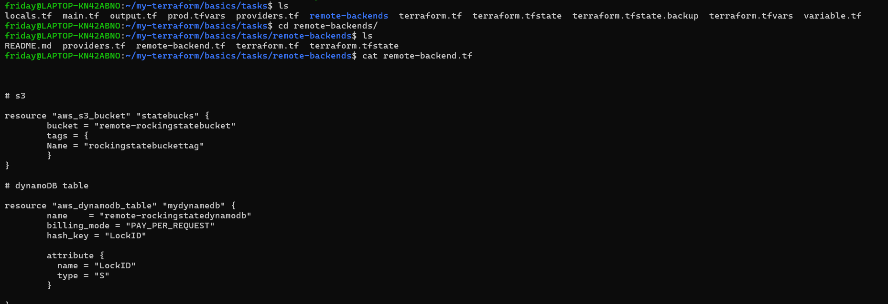

3. Run:
```bash
terraform init
```
Terraform will ask: "Do you want to copy existing state to the new backend?" -- say yes.

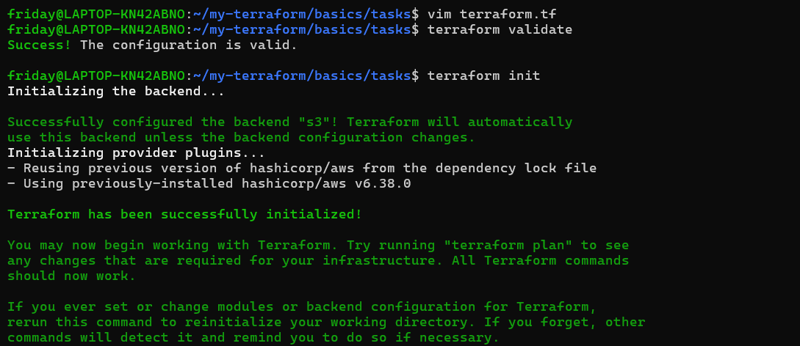

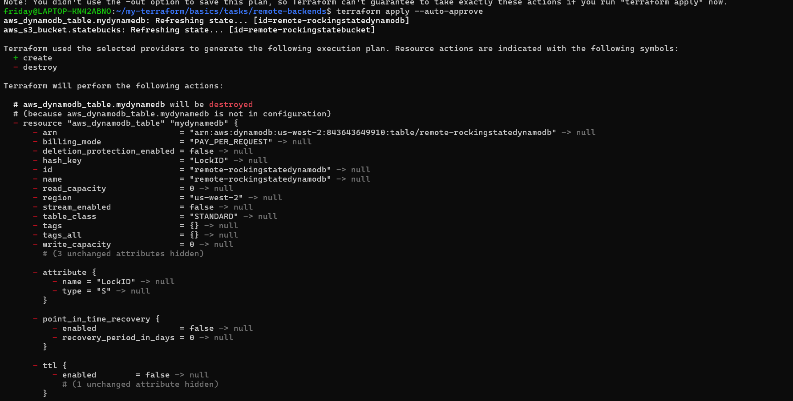


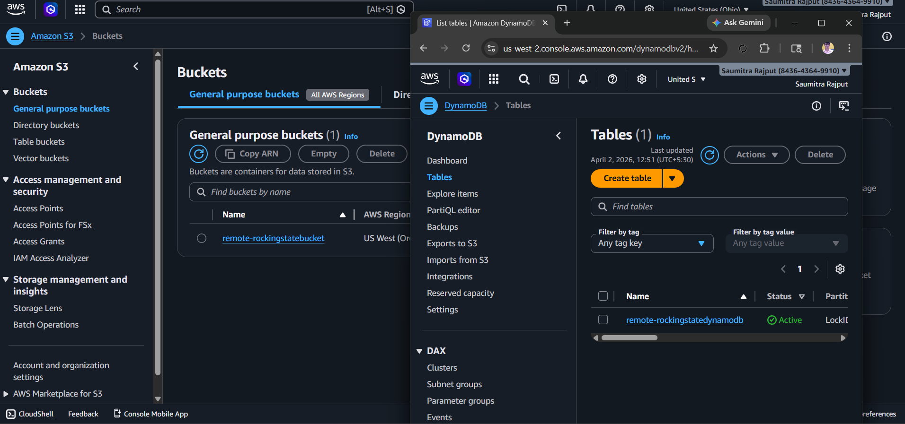
4. Verify:
   - Check the S3 bucket -- you should see `dev/terraform.tfstate`
   - Your local `terraform.tfstate` should now be empty or gone
   - Run `terraform plan` -- it should show no changes (state migrated correctly)


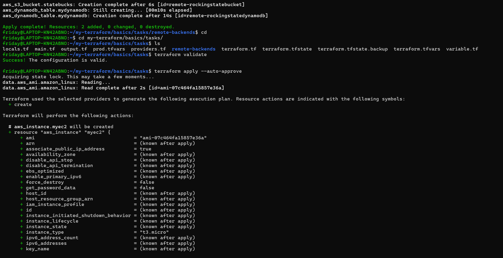

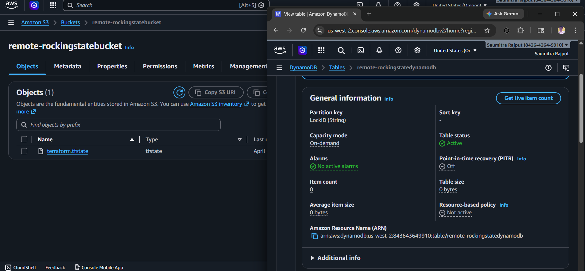
---

### Task 3: Test State Locking
State locking prevents two people from running `terraform apply` at the same time and corrupting the state.

1. Open **two terminals** in the same project directory
2. In Terminal 1, run:
```bash
terraform apply
```
3. While Terminal 1 is waiting for confirmation, in Terminal 2 run:
```bash
terraform plan
```
4. Terminal 2 should show a **lock error** with a Lock ID

**Document:** What is the error message? Why is locking critical for team environments?

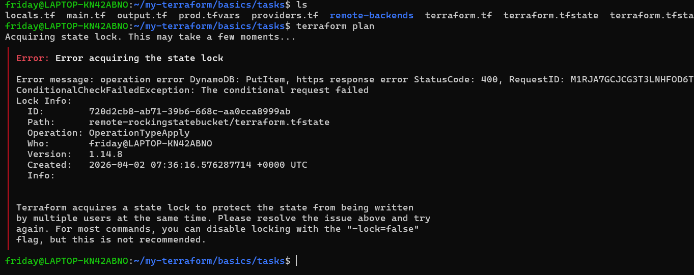

5. After the test, if you get stuck with a stale lock:
```bash
terraform force-unlock <LOCK_ID>
```

### Remote-backedend clean up
clean up/removed remote-backend/setting up back to local tfstate
- 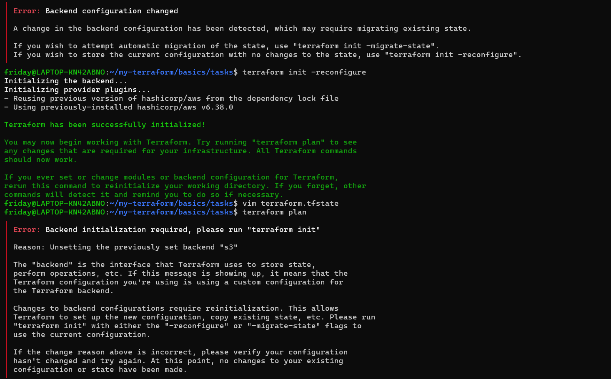

check the file and delete rm -rf .terraform terraform.tfstate terraform.tfstate.backup (backup is optional)
- 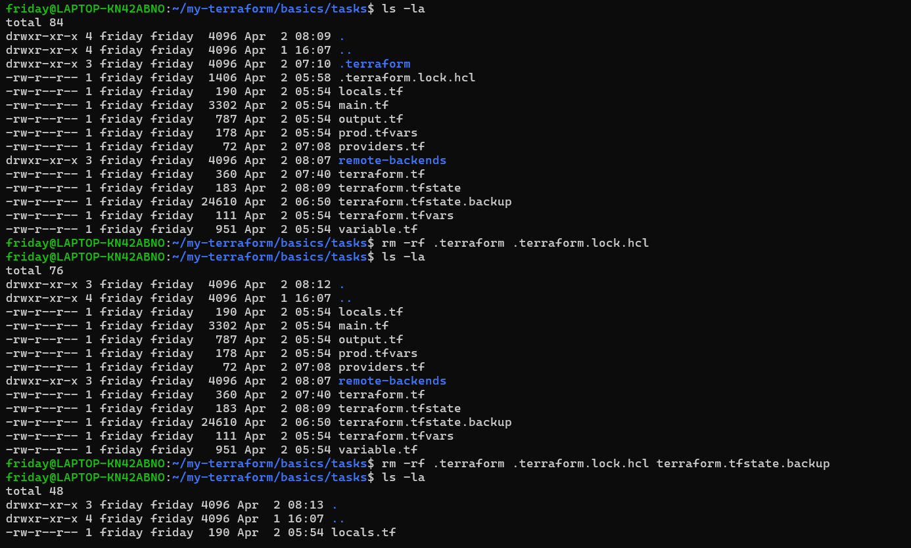

fix
- 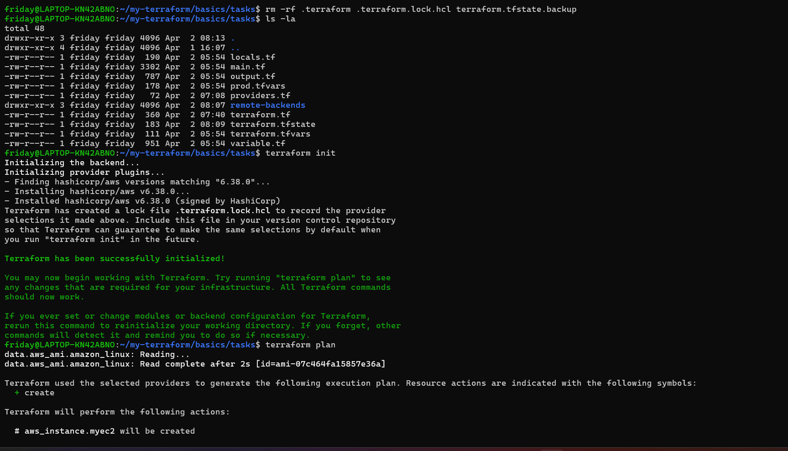

---

### Task 4: Import an Existing Resource
Not everything starts with Terraform. Sometimes resources already exist in AWS and you need to bring them under Terraform management.

1. Manually create an S3 bucket in the AWS console -- name it `terraweek-import-test-<yourname>`
2. Write a `resource "aws_s3_bucket"` block in your config for this bucket (just the bucket name, nothing else)
3. Import it:
```bash
terraform import aws_s3_bucket.imported terraweek-import-test-<yourname>
```

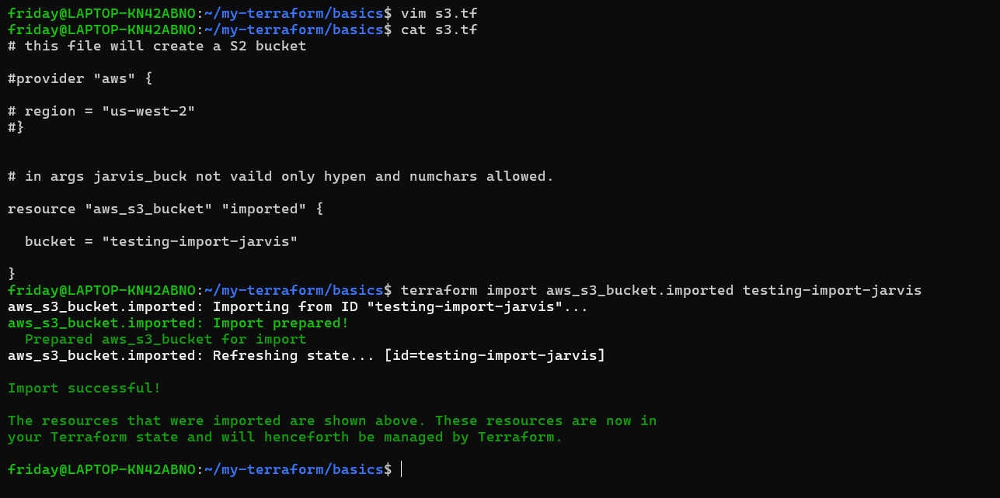

4. Run `terraform plan`:
   - If you see "No changes" -- the import was perfect
   - If you see changes -- your config does not match reality. Update your config to match, then plan again until you get "No changes"

5. Run `terraform state list` -- the imported bucket should now appear alongside your other resources


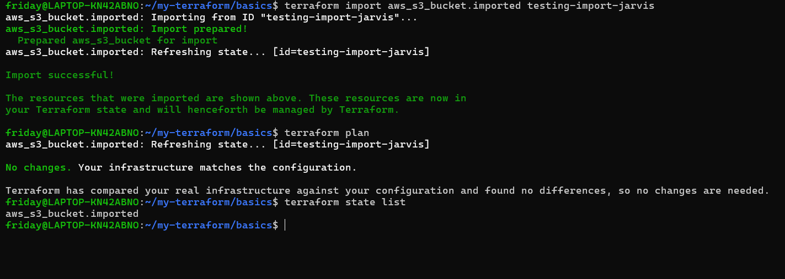

**Document:** What is the difference between `terraform import` and creating a resource from scratch?

terraform import → "start managing existing resource"

terraform apply (new resource) → "create and manage resource"
---

### Task 5: State Surgery -- mv and rm
Sometimes you need to rename a resource or remove it from state without destroying it in AWS.

1. **Rename a resource in state:**
```bash
terraform state list                              # Note the current resource names
terraform state mv aws_s3_bucket.imported aws_s3_bucket.logs_bucket
```
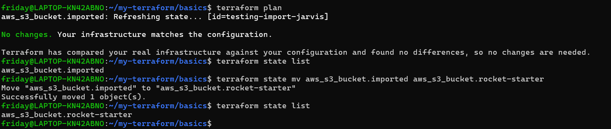
This updates the state only

No changes are made in AWS


Update your `.tf` file to match the new name. Run `terraform plan` -- it should show no changes.
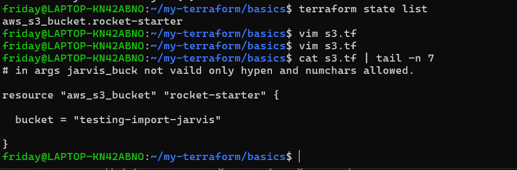

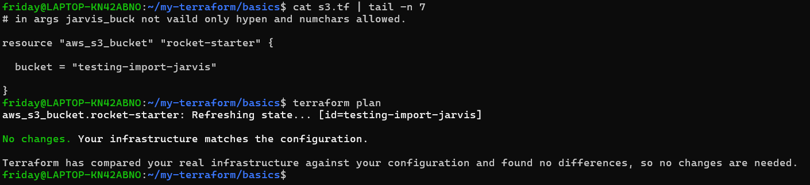

2. **Remove a resource from state (without destroying it):**
```bash
terraform state rm aws_s3_bucket.logs_bucket
```

Terraform forgets the resource

Resource still exists in AWS

Run `terraform plan` -- Terraform no longer knows about the bucket, but it still exists in AWS.
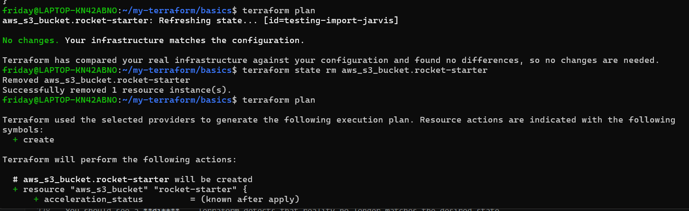

3. **Re-import it** to bring it back:
```bash
terraform import aws_s3_bucket.logs_bucket terraweek-import-test-<yourname>
```
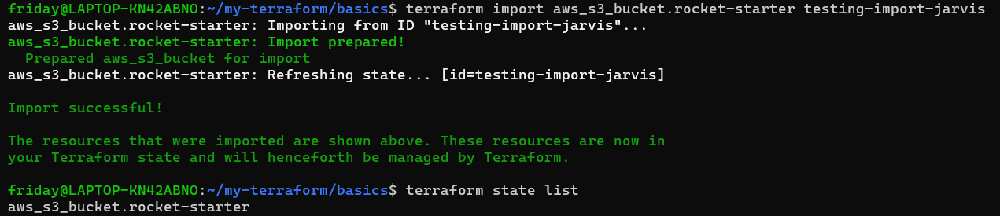
**Document:** When would you use `state mv` in a real project? When would you use `state rm`?


fixed the bucket state back to original 
- 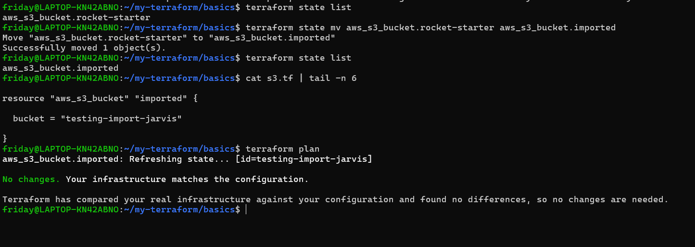
---

💡 Summary
state mv → rename without recreation

state rm → stop managing resource

import → start managing existing resource again

### Task 6: Simulate and Fix State Drift
State drift happens when someone changes infrastructure outside of Terraform -- through the AWS console, CLI, or another tool.
State drift occurs when infrastructure is modified **outside Terraform** (AWS Console, CLI, etc.), causing a mismatch between:
- Terraform state (expected)
- Actual infrastructure (real)

---

1. Apply your full config so everything is in sync
2. Go to the **AWS console** and manually:
   - Change the Name tag of your EC2 instance to `"ManuallyChanged"`
   - Change the instance type if it's stopped (or add a new tag)
3. Run:
```bash
terraform plan
```

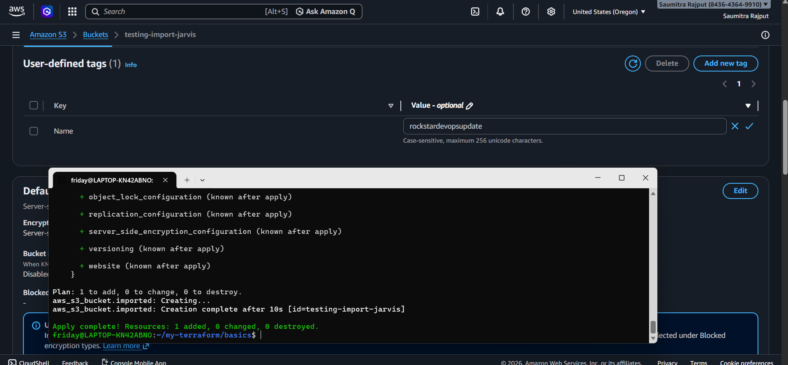
You should see a **diff** -- Terraform detects that reality no longer matches the desired state.
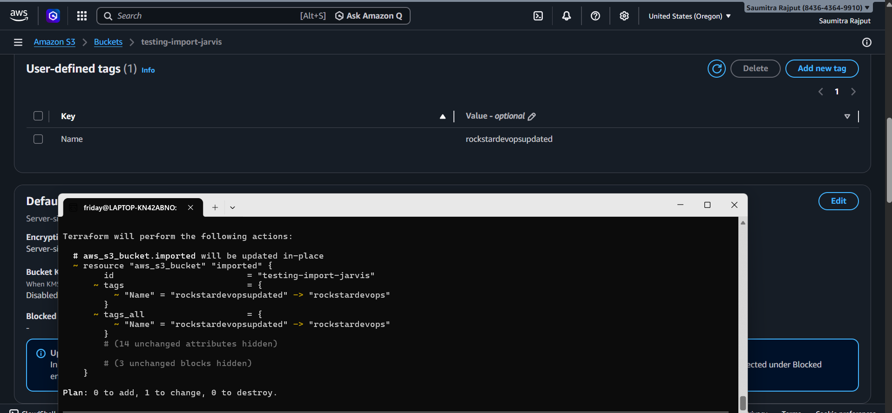

4. You have two choices:
   - **Option A:** Run `terraform apply` to force reality back to match your config (reconcile)
   - **Option B:** Update your `.tf` files to match the manual change (accept the drift)

5. Choose Option A -- apply and verify the tags are restored.

6. Run `terraform plan` again -- it should show "No changes." Drift resolved.

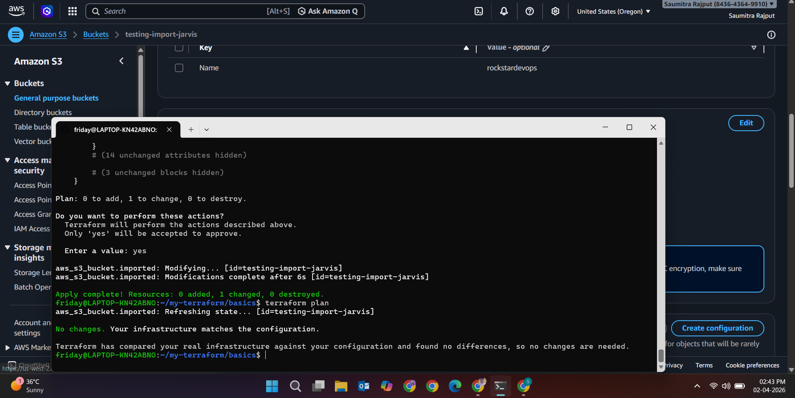

**Document:** How do teams prevent state drift in production? (hint: restrict console access, use CI/CD for all changes)

Terraform detects drift using terraform plan

Drift happens when changes are made outside Terraform

Two ways to fix:

Reconcile (apply Terraform config)

Accept drift (update config)

Drift = mismatch between state and real infra

terraform plan = detection tool

terraform apply = correction tool
---

## Hints
- S3 bucket names must be globally unique
- DynamoDB table must have a `LockID` string key -- this is what Terraform uses for locking
- `terraform init -migrate-state` explicitly triggers state migration
- `terraform refresh` (or `terraform apply -refresh-only`) updates state to match real infrastructure without making changes
- State locking only works with backends that support it (S3+DynamoDB, Consul, Terraform Cloud)
- `terraform force-unlock` should only be used when you are sure no other operation is running
- Always version your S3 bucket so you can recover a previous state file if something goes wrong

---

## Documentation
Create `day-64-state-management.md` with:
- Diagram: local state vs remote state setup
- Screenshot of state file in S3 bucket
- Screenshot of the lock error from Task 3
- Steps you followed for `terraform import` and the result
- Explanation of state drift with your real example
- When to use: `state mv`, `state rm`, `import`, `force-unlock`, `refresh`

---

## Submission
1. Add `day-64-state-management.md` to `2026/day-64/`
2. Commit and push to your fork

---

## Learn in Public
Share on LinkedIn: "Mastered Terraform state today -- migrated to S3 remote backend with DynamoDB locking, imported existing AWS resources, performed state surgery, and simulated drift. State management is the foundation of reliable infrastructure as code."

`#90DaysOfDevOps` `#TerraWeek` `#DevOpsKaJosh` `#TrainWithShubham`

Happy Learning!
**TrainWithShubham**
